# 
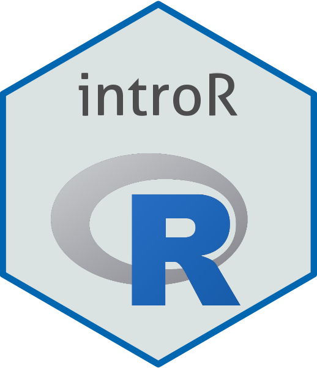{fig-align="center"}

::: footer
[intro-r](https://course-intror.github.io/)
:::

## Site

**Explicando o site**

{fig-align="center"}

::: footer
[intro-r](https://course-intror.github.io/)
:::

## Slides

**Explicando os slides**

   
Este é um [link](https://github.com/mauriciovancine/workshop-r-landscapemetrics) no slide

{.absolute width=55% right=-100 top=140}

::: footer
[Este é um link no rodapé](https://github.com/mauriciovancine/workshop-r-landscapemetrics)
:::

## Maurício Vancine 

::: columns
::: {.column width="50%"}

 

:::

::: {.column width="50%"}
::: {style="font-size: 80%;"}
 

- Ecólogo e Doutor em Ecologia
- Pós-Doutorado em Ecologia Espacial (Prof. Mathias - Unicamp)
- Ecologia Espacial
- Modelagem Ecológica
- Análise de Dados Ecológicos e Espaciais
- Ecologia e Conservação de Anfíbios
- *Open source* (R, QGIS, GNU/Linux)
:::
:::
:::

::: footer
[mauriciovancine.github.io](https://mauriciovancine.github.io/)
:::

## Análises Ecológicas no R (2022)

::::: columns
::: {.column width="50%"}
 

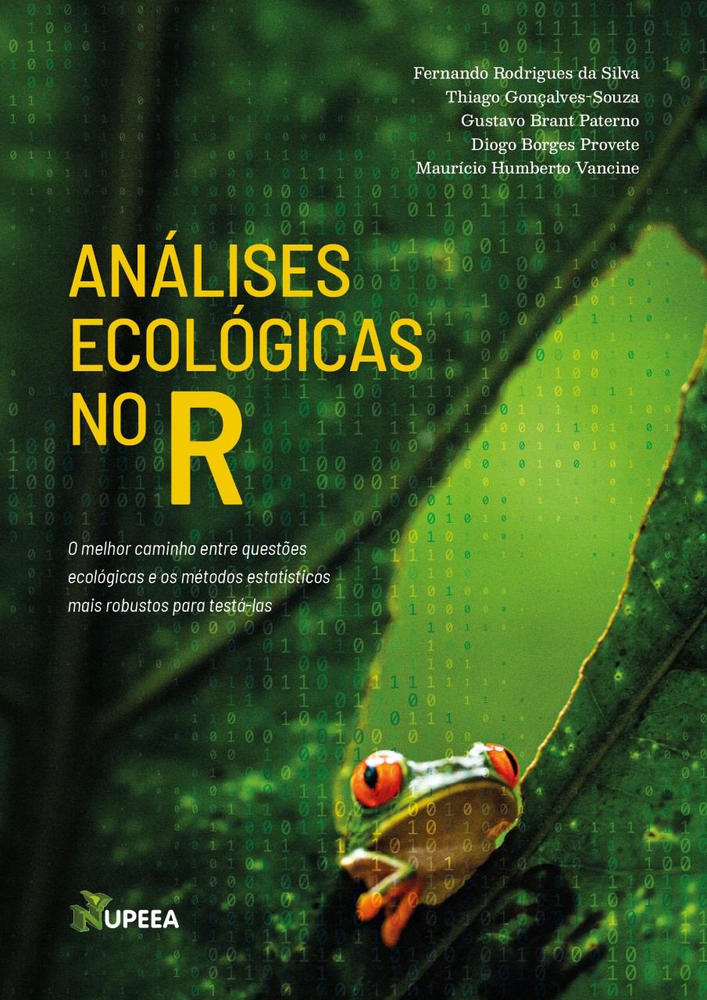

:::

::: {.column width="50%"}
::: {style="font-size: 80%;"}
 

-   **15 capítulos**: linguagem R, tidyverse, questões em ecologia, análises univariadas, multivariadas e espaciais
-   [bookdown](https://analises-ecologicas.com/)
-   [PDF](https://canal6.com.br/livreacesso/livro/analises-ecologicas-no-r/)
-   [Amazon](https://www.amazon.com.br/An%C3%A1lises-ecol%C3%B3gicas-Ferdo-Rodrigues-Silva/dp/857917564X/ref=sr_1_1?keywords=9788579175640&qid=1654379366&sr=8-1)
-   [Code](https://github.com/paternogbc/livro_aer)
-   [YouTube](https://www.youtube.com/channel/UCLSVSCnmvf2k6OoWZCnEO4w)
:::
:::
:::::

::: footer
[Da Silva et al. (2022)](https://analises-ecologicas.com/)
:::

## Artigo da Mata Atlântica (2024)

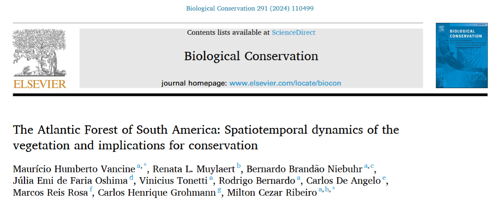{.absolute width=60% right=400 top=100}
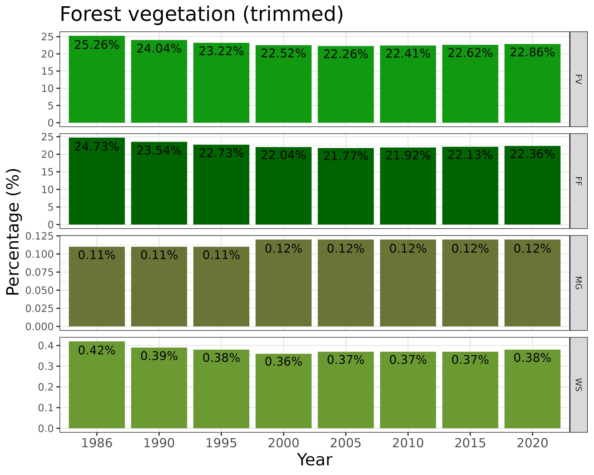{.absolute width=40% right=550 top=360}
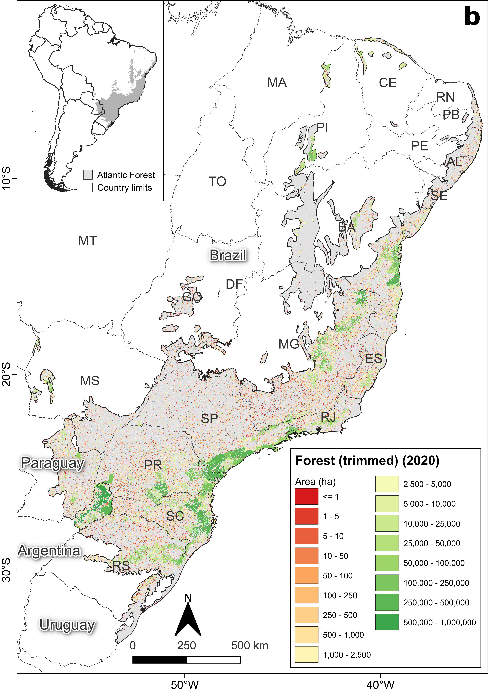{.absolute width=30% right=100 top=230}

::: footer
[Vancine et al. (2024)](https://doi.org/10.1016/j.biocon.2024.110499)
:::

## Artigo da Fragmentação (2025)

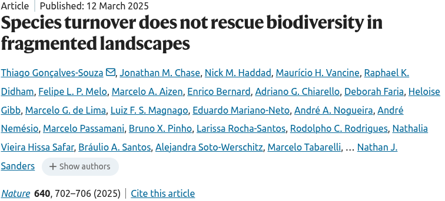{.absolute width=60% right=440 top=100}
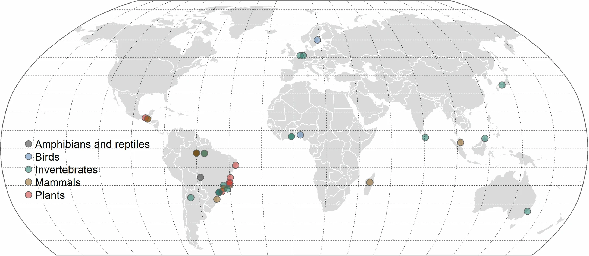{.absolute width=60% right=440 top=400}
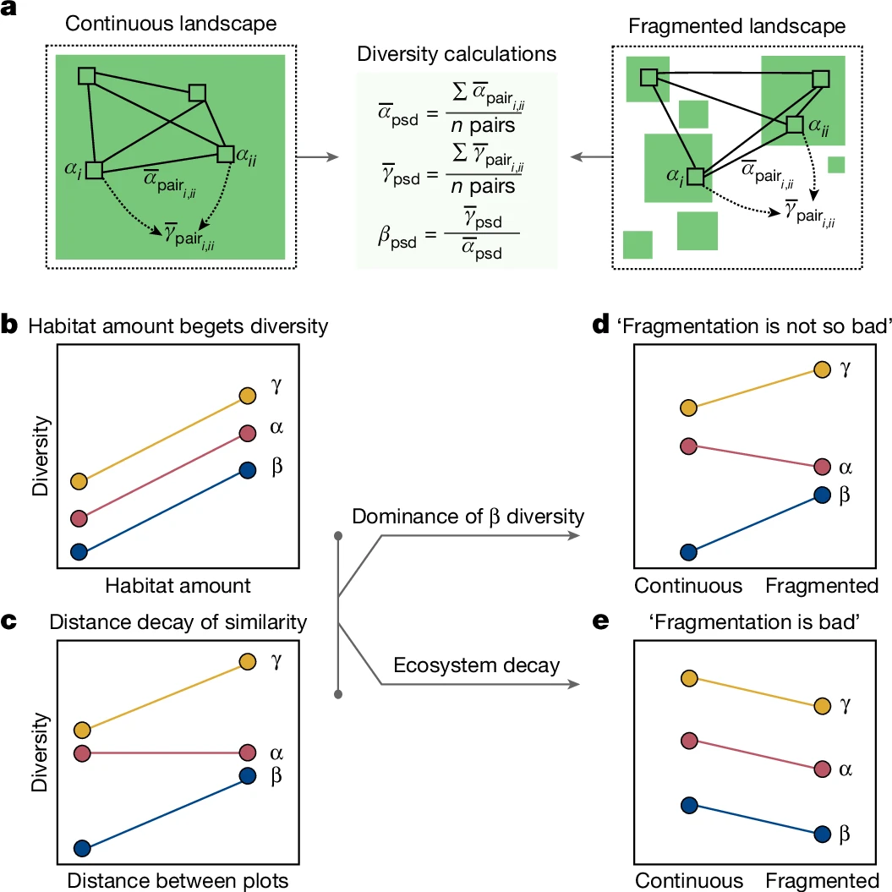{.absolute width=50% right=-100 top=120}

::: footer
[Goncalves-Souza et al. (2025)](https://doi.org/10.1038/s41586-025-08688-7)
:::

## Artigo da Fragmentação (2025)

{.absolute width=60% right=440 top=100}
{.absolute width=60% right=440 top=400}
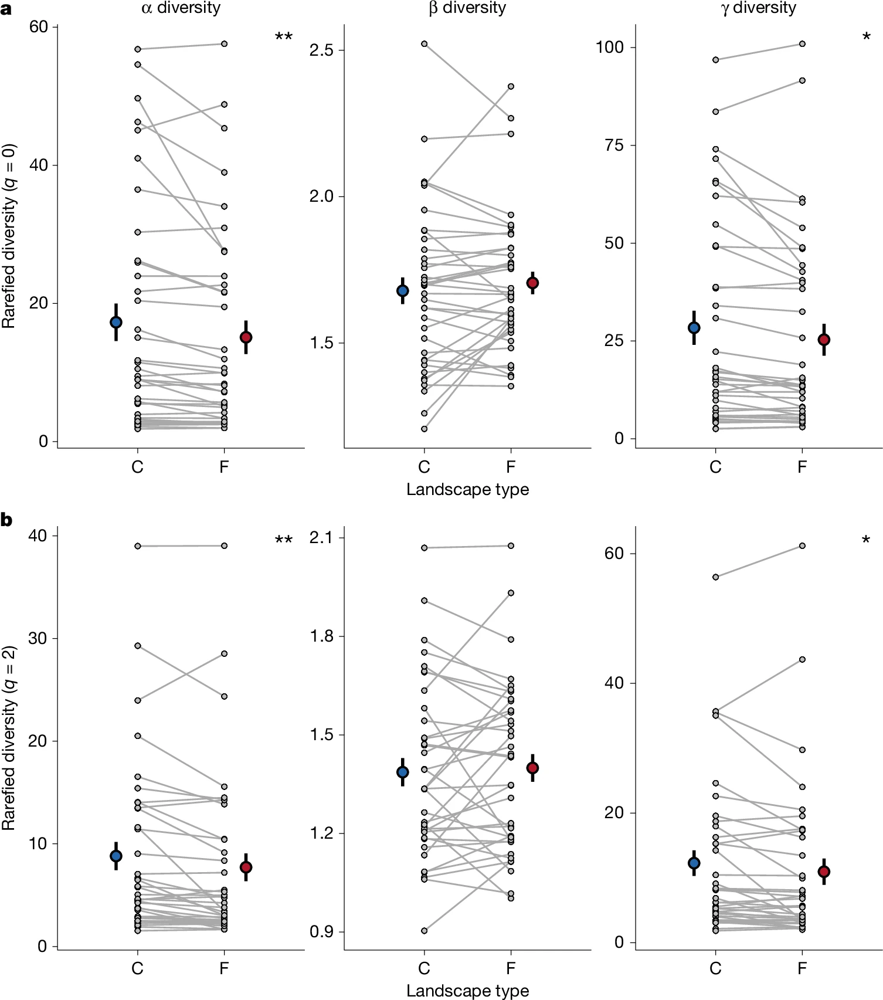{.absolute width=50% right=-100 top=120}

::: footer
[Goncalves-Souza et al. (2025)](https://doi.org/10.1038/s41586-025-08688-7)
:::

## Quem são vocês?

 

1.  Nome
2.  Formação
3.  O que faz ou pensa em fazer da vida?
4.  Conhece algo sobre ciência aberta, controle de versão, R, tidyverse ou programação?
5.  Como se sente em relação à disciplina?

## Cronograma {.smaller}

| Dia | Atividade                         | 
|-----|-----------------------------------|
| Dia 01| Boas-vindas e apresentações | 
| Dia 01| Aula teórica 1: controle de versão |
| Dia 01| Aula prática 1: controle de versão |
| Dia 02| Aula teórica 2: introdução à programação em R (Base R)   |
| Dia 02| Aula teórica 3: introdução à programação em R (tidyverse) |
| Dia 02| Aula teórica 4: introdução à programação em R (visualização) |
| Dia 03| Aula teórica 5: tópicos avançados em programação em R |
| Dia 03| Aula teórica 6: reprodutibilidade em R e GitHub |
| Dia 03| Aula prática 2: reprodutibilidade em R e GitHub |
| Dia 04| Projeto prático: desenvolvimento de uma análise ecológica reprodutível |
| Dia 04| Projeto prático: apresentação dos projetos  |
| Dia 04| Discussão: ciência aberta e reprodutibilidade |

## Projeto

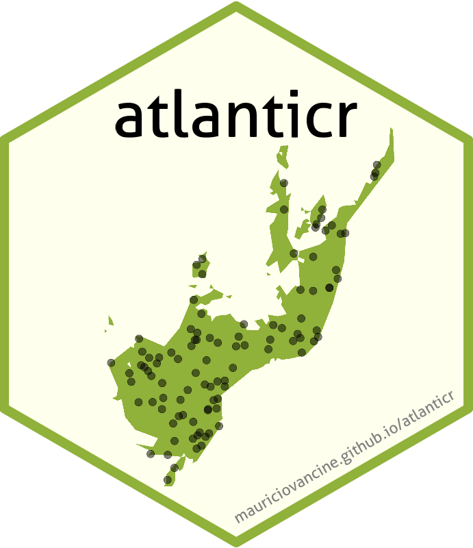{fig-align="center"}

::: footer
[atlanticr](https://mauriciovancine.github.io/atlanticr/)
:::

## Projeto

**ATLANTIC SERIES: Data on the richest Neotropical hotspot**

- Data papers: publicação que apresenta, explica e disponibiliza um banco de dados
- [ATLANTIC: Data Papers from a biodiversity hotspot](https://esajournals.onlinelibrary.wiley.com/doi/toc/10.1002/(ISSN)1939-9170.AtlanticPapers)

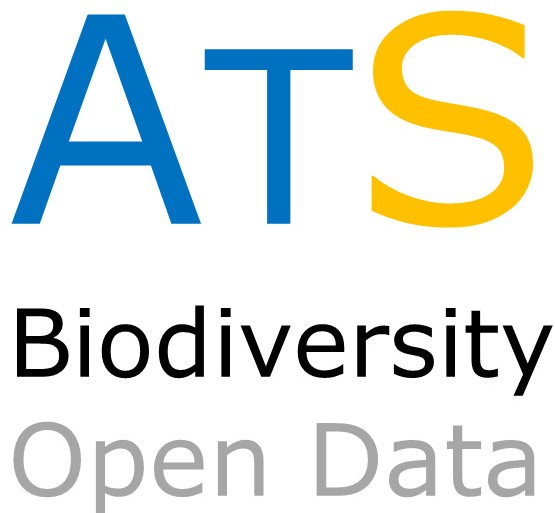{fig-align="center"}

::: footer
[Atlantic Series](https://github.com/LEEClab/Atlantic_series)
:::

## Projeto

**atlanticr**

::: {style="font-size: 70%;"}
- Estes dados estão muito bagunçados
- Gostaria de ajuda para organizar eles e pensar no pacote `atlanticr`
- Grupos, duplas ou individual
- Baixar, organizar e formartar esses dados para uso no pacote atlanticr
:::

{fig-align="center"}

::: footer
[atlanticr](https://mauriciovancine.github.io/atlanticr/)
:::

## IMPORTANTE!!!

**Estamos num espaço seguro e amigável**

- Sintam-se à vontade para me interromper e tirar dúvidas

::: footer
Artwork by [@allison_horst](https://x.com/allison_horst)
:::

# Diretórios e nomes de arquivos

## Diretórios e nomes de arquivos

**Organização diretórios e nomes de arquivos de um projeto**

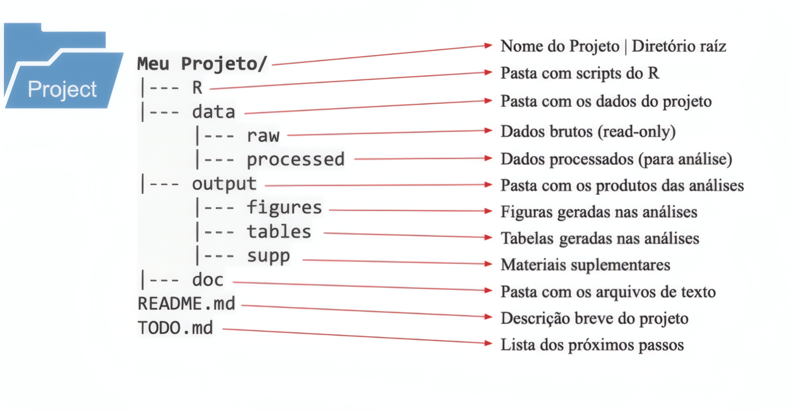

::: footer
[Boas Práticas e Ferramentas da Ciência Aberta na Ecologia - BIE5798](https://gabrielnakamura.github.io/USP_reproducibility_BIE5798/index.html)
:::

## Diretório da disciplina

**Escolham um diretório (pasta) e criem esses diretórios:**

:::: columns
::: {.column width="30%"}
 

:::

::: {.column width="50%"}
::: {style="font-size: 120%;"}
 
course-intror\
|---- 00_plano_ensino\
|---- 01_slides\
|---- 02_scripts\
|---- 03_dados\
|---- 04_projetos\
:::
:::
:::::

::: footer
[FlatIcon](https://www.flaticon.com/free-icon/open-folder_8406407)
:::

# Vamos lá!
