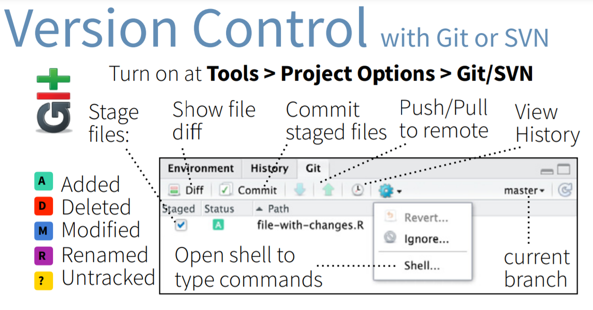

## Prática 1

- Criar um repositório no seu GitHub chamado "teste"

## Prática 2

- Clonar esse repositório no seu computador usando o RStudio

## Prática 3

- Adicionar um script chamado "script.R" com algum código 

## Prática 4

- Fazer um controle de versão usando o terminal:

```{r eval=FALSE}
git add -Av
git commit -m 'add um script'
git push
```

## Prática 5

- Fazer alguma alteração neste script e fazer o controle de versão usando a aba fo git do RStudio:

{fig-align='center'}

## Prática 6

- Criar uma ramificação chamada "branch-1"

## Prática 7

- Adicionar um script chamado "script2.R" com algum código 

