# tidyverse

# 

<center></center>

::: footer
[\@allison_horst](https://twitter.com/allison_horst)
:::

## Conteúdo

### tidyverse

- Contextualização
- tidyverse
- here
- readr, readxl e writexl
- tibble
- magrittr (pipe - %\>%)
- tidyr
- dplyr
- stringr
- forcats
- lubridate
- purrr

## Ciência de dados ambiental (*Environmental Data Science*)

<center>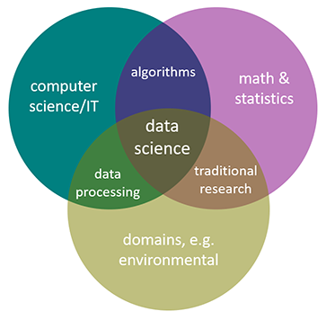</center>

::: footer
[Introduction to Environmental Data Science](https://bookdown.org/igisc/EnvDataSci/)
:::

## Ecoinformatics

<br>

<center>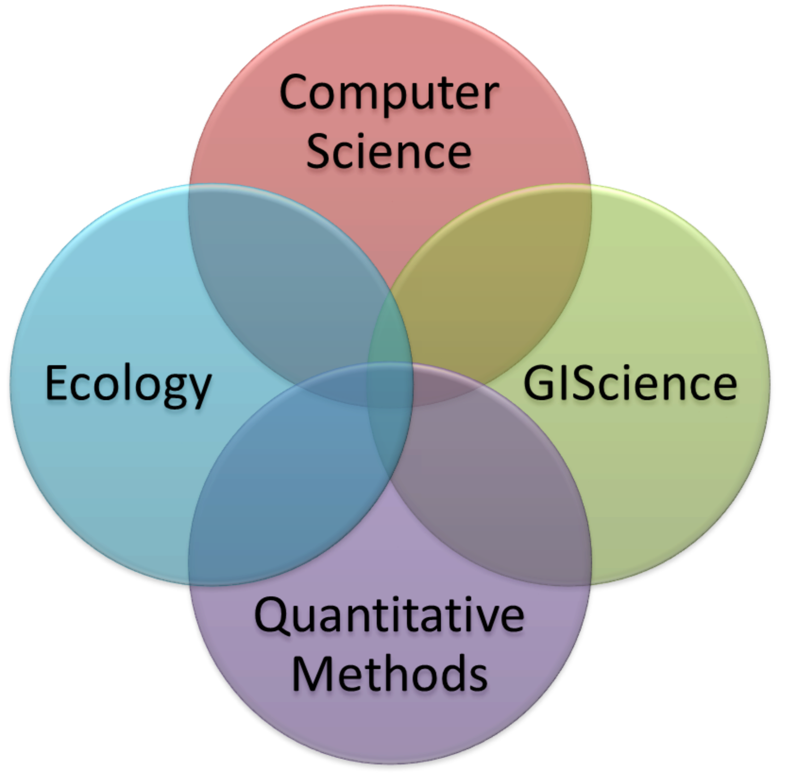</center>

::: footer
[Ecoinformatics Initiative](http://www.uwyo.edu/wygisc/our_research/ongoing_research/ecoinformatics_initiative.html), [Michener & Jones (2012)](https://doi.org/10.1016/j.tree.2011.11.016), [Lin et al. (2020)](https://doi.org/10.22920/PNIE.2020.1.1.9)
:::

## Ciência de dados para ecólogos <br> (*Data Science for Ecologists*)

<center></center>

::: footer
[Data Science for Ecologists and Environmental Scientists](https://ourcodingclub.github.io/course)
:::

## Environmental Data Science

<br>

<center></center>

::: footer
[Environmental Data Science](https://www.cambridge.org/core/journals/environmental-data-science)
:::

# Legal, mas ainda está distante...

## Monitoramento automatizado

<br>

<center>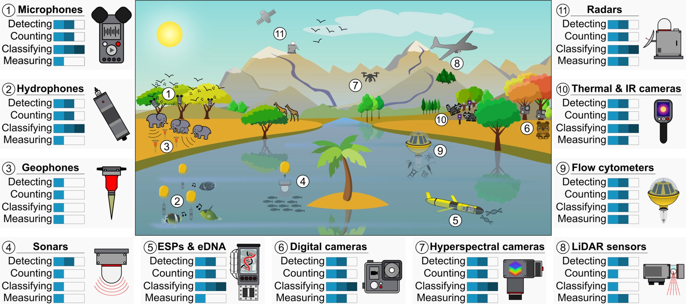</center>

::: footer
[Besson et al. (2022)](https://doi.org/10.1111/ele.14123)
:::

## Monitoramento automatizado

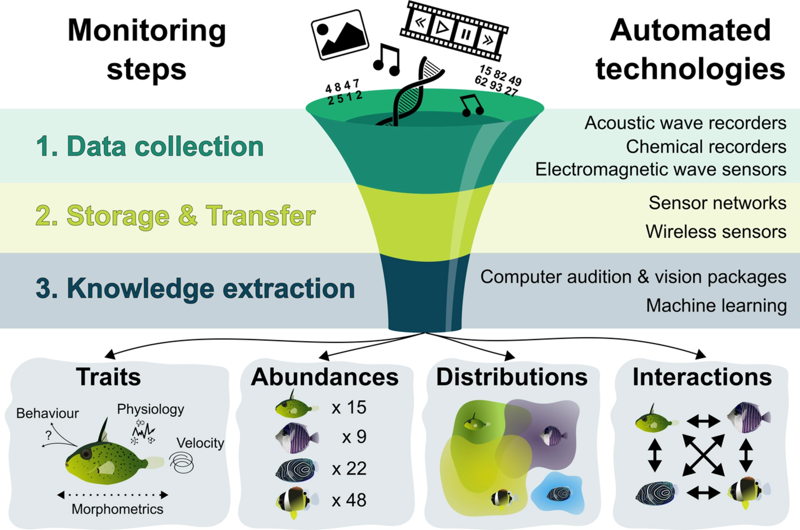{.absolute width="600" height="450" right="450" top="150"} 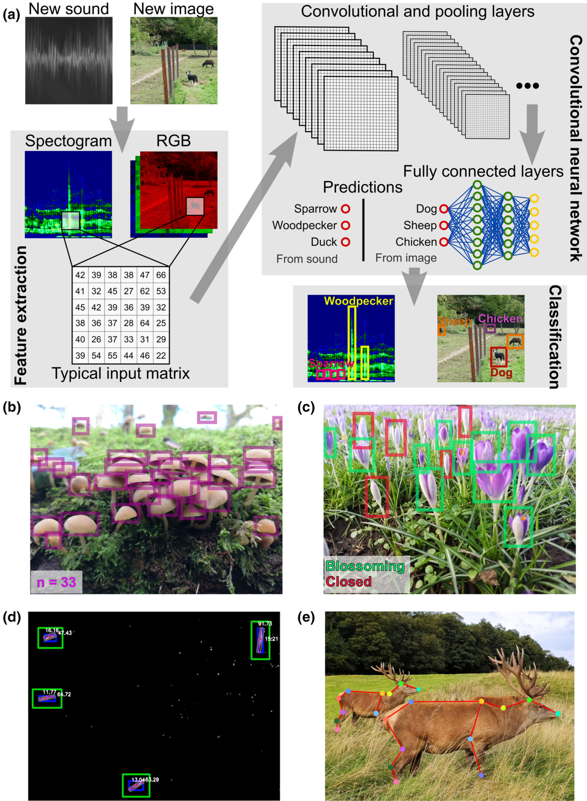{.absolute width="400" height="550" right="0" top="100"}

::: footer
[Besson et al. (2022)](https://doi.org/10.1111/ele.14123)
:::

## Script

Abram o script

<br><br><br><br>

`02_script_r_introduction.R`

# tidyverse

## Descrição

-   O `tidyverse` é um conjunto de pacotes designados para *Data Science*

-   Todos os pacotes compartilham uma filosofia de design, gramática e estruturas de dados

-   É um "dialeto novo" para a linguagem R

**tidy**: organizado, arrumado, ordenado\
**verse**: universo

::: footer
[What is the tidyverse?](https://rviews.rstudio.com/2017/06/08/what-is-the-tidyverse/)
:::

## Fluxo de trabalho

<br><br>

<center>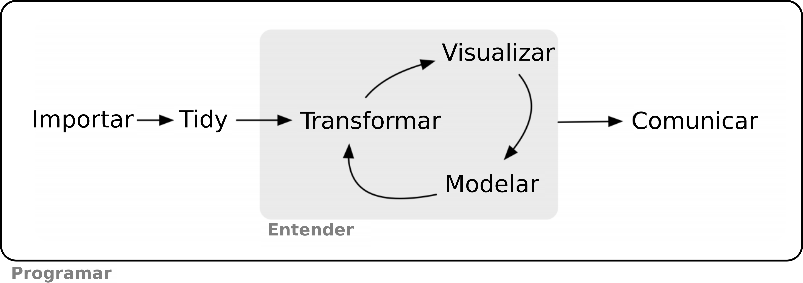</center>

::: footer
[Wickham & Grolemund (2017)](https://r4ds.had.co.nz/)
:::

## Pacotes

<center>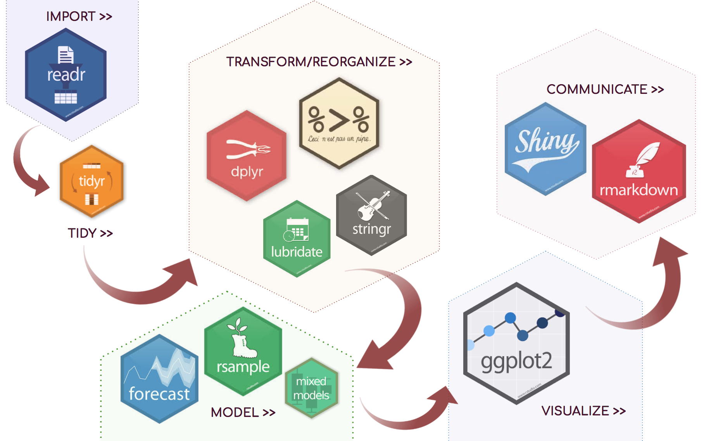</center>

## Artigos {.smaller}

-   Wickham, Hadley. "Tidy data." Journal of Statistical Software 59.10 (2014): 1-23.

-   Wickham, Hadley, et al. "Welcome to the Tidyverse." Journal of Open Source Software 4.43 (2019): 1686.

<center>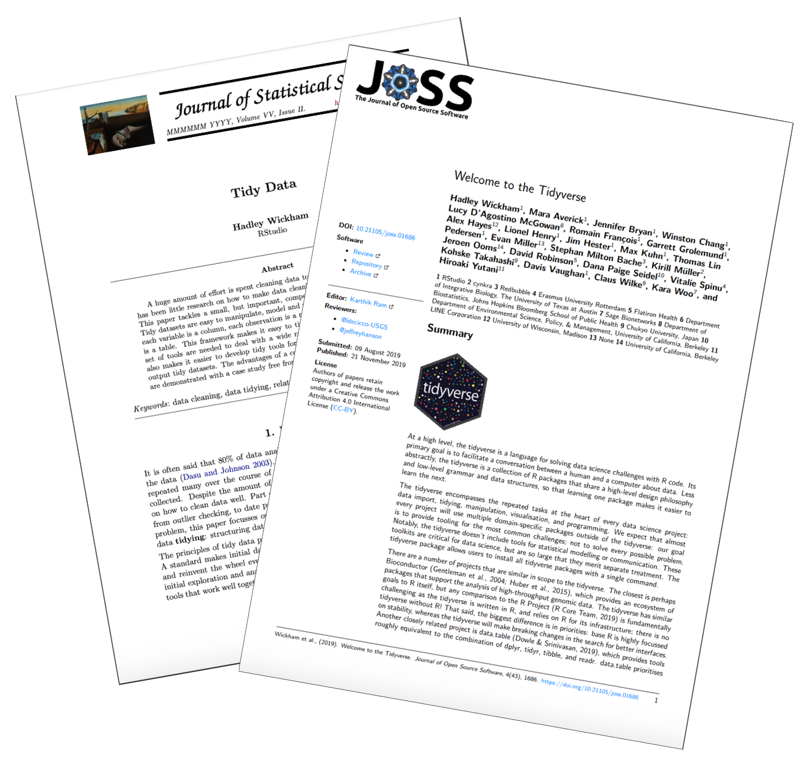</center>

::: footer
[Wickham (2014)](https://www.jstatsoft.org/article/view/v059i10), [Wickham et al. (2019)](https://joss.theoj.org/papers/10.21105/joss.01686)
:::

## Livro

<center>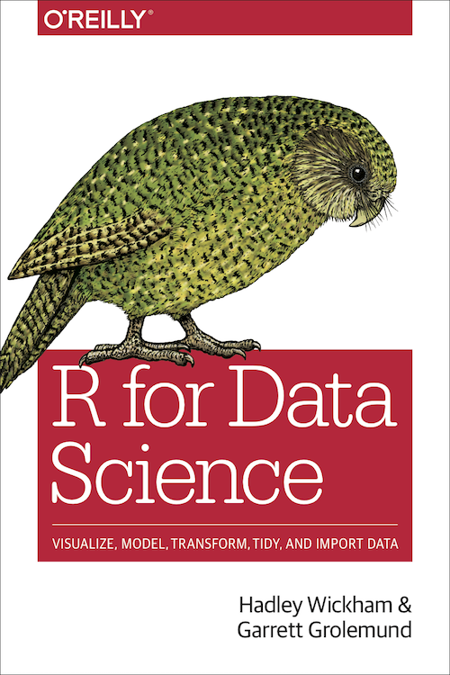</center>

::: footer
[Wickham & Grolemund (2017)](https://r4ds.had.co.nz/)
:::

## Site

<br>

<center>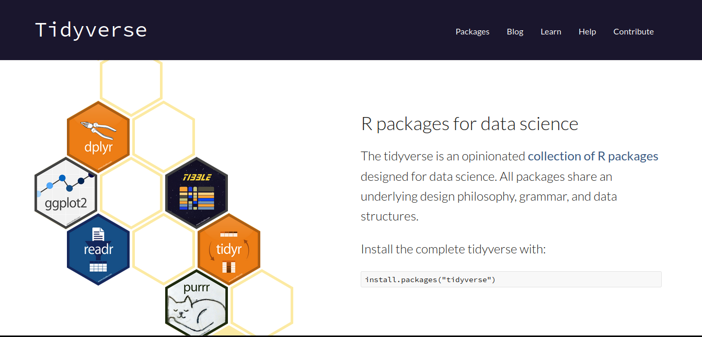</center>

::: footer
[tidyverse](https://www.tidyverse.org/)
:::

# 

<center></center>

::: footer
[tidyverse](https://tidyverse.tidyverse.org/)
:::

## tidyverse

Para utilizar os pacotes é preciso instalar e carregar o pacote `tidyverse`

```{r eval=FALSE}
# instalar pacote
install.packages("tidyverse")
```

```{r message=TRUE}
# carregar pacote
library(tidyverse)
```

## Pacotes do tidyverse

**Listar os pacotes**

```{r}
# listar todos os pacotes no tidyverse 
tidyverse::tidyverse_packages(include_self = TRUE)
```

## Sintaxe

Todas as funções dos pacotes `tidyverse` usam `fonte minúscula` e `_` para separar os nomes internos das funções (`snake_case`)

<br> `read_csv()`

`read_xlsx()`

`as_tibble()`

`left_join()`

`group_by()`

{.absolute width="500" height="250" right="150" top="350"}

## Sintaxe

Geralmente indica-se de quais pacotes as funções são utilizadas (`pacote::função`) para evitar erros com outros pacotes

<br> `readr::read_csv()`

`readxl::read_xlsx()`

`tibble::as_tibble()`

`dplyr::left_join()`

`dplyr::group_by()`

# 

<center></center>

::: footer
[readr](https://readr.tidyverse.org/)
:::

## Descrição {.smaller}

-   Carrega e salva grandes arquivos de forma rápida

-   As funções fornecem medidores de progresso (*big data*)

-   Classificam o modo (tipo dos dados) de cada coluna

-   A classe do objeto atribuído é `tibble`

-   Funções:

-   `read_csv()`: lê arquivos *Comma-separated values*

-   `read_csv2()`: lê arquivos *Comma-separated values* (separado por ;)

-   `read_tsv()`: lê arquivos *Tab-separated values*

-   `read_delim()`: lê arquivos *delim-separated values*

-   `write_csv()`: escreve arquivos *Comma-separated values*

-   `write_csv2()`: escreve arquivos *Comma-separated values* (separado por ;)

-   `write_delim()`: escreve arquivos *delim-separated values*

## Diretório

Caminho no computador para importar e exportar dados

**Definir diretório**

```{r}
# definir diretorio
setwd("/home/mude/data/github/mauriciovancine/workshop-r-introduction/01_slides")
```

**Conferir diretório**

```{r}
# conferir diretorio
getwd()

# listar arquivos
dir()
```

## Importar dados

ATLANTIC AMPHIBIANS: a dataset of amphibian communities from the Atlantic Forests of South America

<center></center>

::: footer
[Vancine et al. (2018)](https://doi.org/10.1002/ecy.2392)
:::

## Importar dados

**Formato .csv**

```{r}
# importar csv
si <- readr::read_csv("../data/ATLANTIC_AMPHIBIANS_sites.csv")
si
```

## Importar dados

**Formato .txt**

```{r}
# importar txt
si <- readr::read_tsv("../data/ATLANTIC_AMPHIBIANS_sites.txt")
si
```

# 

<center></center>

::: footer
[readxl](https://readxl.tidyverse.org/)
:::

## Descrição {.smaller}

Pacotes para importar e exportar planilhas no formato Excel®

-   Carrega e salva grandes arquivos de forma rápida

-   As funções fornecem medidores de progresso (*big data*)

-   Classificam o modo (tipo dos dados) de cada coluna

-   A classe do objeto atribuído é `tibble`

-   Funções:

-   `read_excel()`: lê arquivos de planilhas Excel®

-   `read_xls()`: lê arquivos de planilhas Excel® (antes de 2010)

-   `write_xlsx()`: escreve arquivos de planilhas Excel®

```{r eval=FALSE}
# importar .xlsx
install.packages("readxl")
library("readxl")

# exportar .xlsx
install.packages("writexl")
library("writexl")
```

## Importar dados

**Formato .xlsx**

```{r}
# importar xlsx
si <- readxl::read_excel("../data/ATLANTIC_AMPHIBIANS_sites.xlsx")
si
```

## Exportar dados

**Diversos formatos**

```{r eval=FALSE}
# exportar csv
readr::write_csv(si, "ATLANTIC_AMPHIBIANS_sites_exportado.csv")

# exportar txt
readr::write_tsv(si, "ATLANTIC_AMPHIBIANS_sites_exportado.txt")

# exportar excel
writexl::write_xlsx(si, "ATLANTIC_AMPHIBIANS_sites_exportado.xlsx")
```

# 

<center></center>

::: footer
[tibble](https://tibble.tidyverse.org/)
:::

## Descrição {.smaller}

-   Dados importados de planilhas eletrônicas são *data frames* (quadro de dados)

-   `tibble` (classe `tbl_df`) é um tipo especial de data frame

-   Classe adequada para o funcionamento das das funções do `tidyverse`

```{r eval=FALSE}
# tibble
tb <- tibble::tibble(a = 1:10)
tb

as.data.frame(tb)
```

<br>

<center>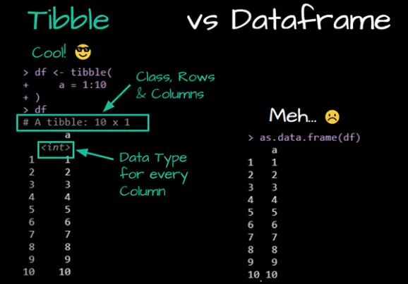</center>

## Espiando os dados {.smaller}

-   Descrição dos dados: linhas (*Rows*) e colunas (*Columns*)

-   Descrição das colunas: *numbers(int, dbl)*, *character(chr)*, *logical(lgl)* ou *factor(fctr)*

```{r}
# descricao dos dados de sites
tibble::glimpse(si)
```

# 

<center>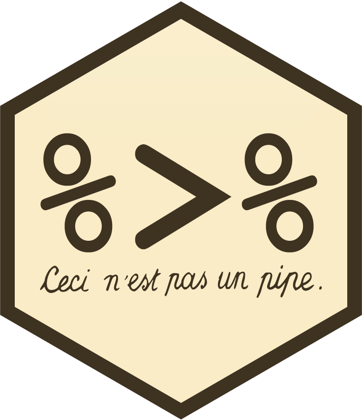</center>

::: footer
[magrittr](https://magrittr.tidyverse.org/)
:::

## René Magritte (1898-1967)

-   Artista surrealista belga

-   "Ceci n'est pas une pipe"

-   Isso não é um cachimbo

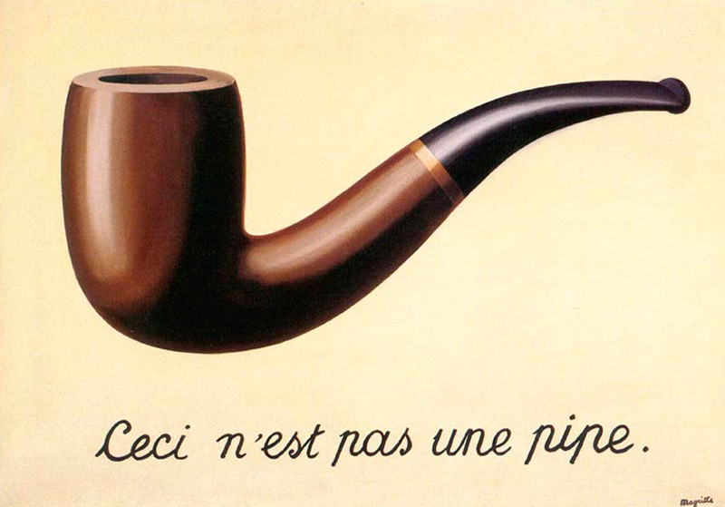{.absolute width="500" height="300" right="550" top="350"}

{.absolute width="500" height="500" right="-50" top="150"}

## Descrição {.smaller}

-   *Pipe* pode ser traduzido como "cano" ou "tubo"

-   Permite o "encadeamento" de várias funções sem armazenar resultados intermediários

-   Captura o resultado de uma função e torna a entrada da próxima função

-   Os códigos se tornam mais simples, pois permite a leitura sequencial do mesmo

-   Operador pipe: `%>%`

-   Atalho: `crtl + shift + M`

```{r eval=FALSE}
# sem pipe
obj <- funcao2(funcao1(dados))

# pipe
obj <- dados %>% 
  funcao1() %>% 
  funcao2()
```

# Se preparem para uma revisão de funções compostas

## Função composta

**Função composta no R**

```{r}
# sem pipe
sqrt(sum(1:100))
```

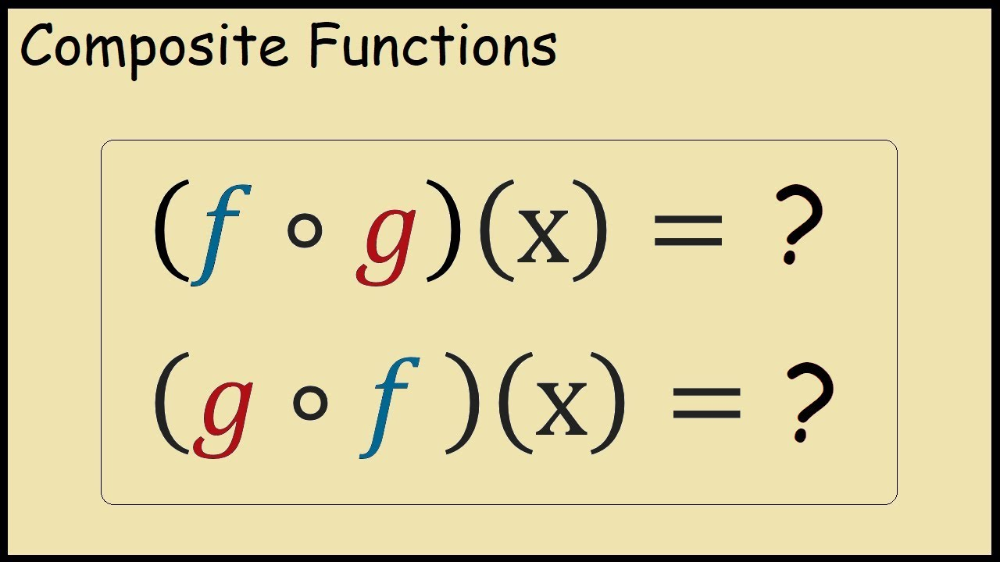{.absolute width="500" height="250" right="550" top="350"}

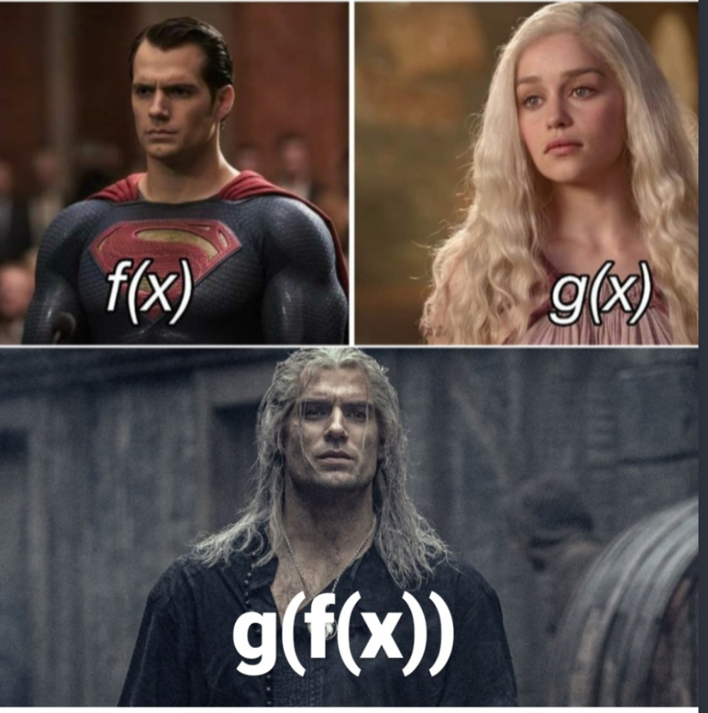{.absolute width="450" height="450" right="0" top="250"}

## pipe {.smaller}

**Sem pipe**

```{r}
# sem pipe
sqrt(sum(1:100))
```

**Com pipe**

```{r}
# com pipe
1:100 %>% 
  sum() %>% 
  sqrt()
```

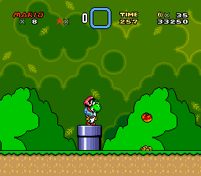{.absolute width="350" height="300" right="430" top="400"}

{.absolute width="400" height="300" right="0" top="400"}

## pipe

**Sem pipe**

```{r}
# fixar amostragem
set.seed(42)

# sem pipe
ve <- sqrt(sum(sample(0:60, 6)))
ve
```

**Com pipe**

```{r}
# fixar amostragem
set.seed(42)

# com pipe
ve <- sample(0:60, 6) %>% 
  sum() %>%
  sqrt() 
ve  
```

## Exercício 01

Reescreva cada uma das operações utilizando pipes `%>%`

`log10(cumsum(1:100))`

`sum(sqrt(abs(rnorm(100))))`

`sum(log((sample(1:10, 10000, rep = TRUE)))`

```{r echo=FALSE}
countdown::countdown(minutes = 5, seconds = 00, color_background = "gray30", font_size = "2em", play_sound = TRUE)
```

## Exercício 01

**Solução**

```{r eval=FALSE}
# solucao 1
log10(cumsum(1:100))

1:100 %>%
  cumsum() %>% 
  log10()
```

## Exercício 01

**Solução**

```{r eval=FALSE}
# solucao 2
sum(sqrt(abs(rnorm(100))))

rnorm(100) %>% 
  abs() %>% 
  sqrt() %>% 
  sum()
```

## Exercício 01

**Solução**

```{r eval=FALSE}
# solucao 3
sum(log(sample(1:10, 10000, rep = TRUE)))

sample(1:10, 10000, rep = TRUE) %>% 
  log() %>% 
  sum()
```

# Para apresentar os próximos pacotes, vamos usar dados de pinguins!

# 

<center></center>

::: footer
[palmerpenguins](https://allisonhorst.github.io/palmerpenguins/)
:::

## palmerpenguins {.smaller}

-   Dados de medidas de pinguins chamados `palmerpenguins`

-   Dados coletados e disponibilizados pela [Dra. Kristen Gorman](https://www.uaf.edu/cfos/people/faculty/detail/kristen-gorman.php) e pela [Palmer Station, Antarctica LTER](https://pal.lternet.edu/), membro da [Long Term Ecological Research Network](https://lternet.edu/)

-   Dois conjuntos de dados:

-   `penguins_raw` (dados brutos)

-   `penguins` (versão simplificada)

{.absolute width="700" height="400" right="-50" top="300"}

::: footer
[palmerpenguins](https://allisonhorst.github.io/palmerpenguins/)
:::

## palmerpenguins

```{r eval=FALSE}
# instalar 
install.packages("palmerpenguins")

# carregar
library(palmerpenguins)

# ajuda dos dados
?penguins
?penguins_raw
```

```{r echo=FALSE}
library(palmerpenguins)
```

<center></center>

::: footer
[palmerpenguins](https://allisonhorst.github.io/palmerpenguins/)
:::

## palmerpenguins

```{r eval=FALSE}
# visualizar os dados
penguins
penguins_raw

# glimpse
tibble::glimpse(penguins)
tibble::glimpse(penguins_raw)
```

<br>

<center></center>

::: footer
[palmerpenguins](https://allisonhorst.github.io/palmerpenguins/)
:::

# 

<center></center>

::: footer
[tidyr](https://tidyr.tidyverse.org/)
:::

## Descrição {.smaller}

-   Funções para tornar um conjunto de dados *tidy* (organizados), facilitando a manipulação, modelagem e visualização

-   Um conjunto de dados é condiderando *tidy* quando:

1.  Cada variável está em uma coluna
2.  Cada observação está em uma linha
3.  Cada valor está em uma célula

<center>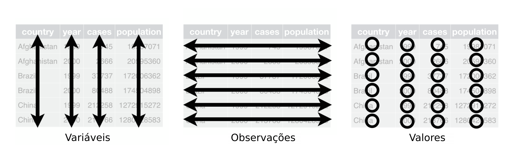</center>

::: footer
[Wickham & Grolemund (2017)](https://r4ds.had.co.nz/)
:::

## Funções {.smaller}

<center></center>

::: footer
[\@allison_horst](https://twitter.com/allison_horst)
:::

## unite

Une dados de múltiplas colunas em apenas uma coluna

```{r}
# unir colunas
penguins_raw_unir <- tidyr::unite(data = penguins_raw, 
                                  col = "region_island",
                                  Region:Island, 
                                  sep = ", ",
                                  remove = FALSE)
head(penguins_raw_unir[, c("Region", "Island", "region_island")])
```

## separate

Separa caracteres de uma coluna em múltiplas colunas

```{r}
# separar colunas
penguins_raw_separar <- tidyr::separate(data = penguins_raw, 
                                        col = Stage,
                                        into = c("stage", "egg_stage"), 
                                        sep = ", ",
                                        remove = FALSE)
head(penguins_raw_separar[, c("Stage", "stage", "egg_stage")])
```

## drop_na

Remove linhas com `NA` de todas as colunas

```{r}
# remover linhas com na
penguins_raw_todas_na <- tidyr::drop_na(data = penguins_raw)
head(penguins_raw_todas_na)
```

## drop_na

Remove linhas com `NA` de uma única coluna

```{r}
# remover linhas com na de uma coluna
penguins_raw_colunas_na <- tidyr::drop_na(data = penguins_raw,
                                          any_of("Comments"))
head(penguins_raw_colunas_na[, "Comments"])
```

# Exercícios

## Exercício 02

Use os dados `penguins_raw`

Faça a união das colunas `studyName` e `Individual ID` na coluna `StudyInd`

Separe as colunas por `-`

```{r echo=FALSE}
countdown::countdown(minutes = 5, seconds = 00, color_background = "gray30")
```

## Exercício 02

**Solução**

```{r}
# exercicio 02
penguins_raw_uni_ind <- penguins_raw %>% 
  tidyr::unite(col = "StudyInd",
               c(studyName, `Individual ID`), 
               sep = " - ",
               remove = FALSE)
head(penguins_raw_uni_ind[, c("studyName", "Individual ID", "StudyInd")])
```

## Exercício 03

Use os dados `penguins_raw`

Separe as informações de ano, mês e dia da coluna `Date Egg`

```{r echo=FALSE}
countdown::countdown(minutes = 5, seconds = 00, color_background = "gray30")
```

## Exercício 03

**Solução**

```{r}
# exercicio 03
penguins_raw_sep_data <- penguins_raw %>% 
  tidyr::separate(col = `Date Egg`, 
                  into = c("Year", "Month", "Day"), 
                  sep = "-",
                  remove = FALSE)
head(penguins_raw_sep_data[, c("Date Egg", "Year", "Month", "Day")])
```

## Exercício 04

Use os dados `penguins_raw`

Remova as linhas que possuem `NA` na coluna `Body`

```{r echo=FALSE}
countdown::countdown(minutes = 5, seconds = 00, color_background = "gray30")
```

## Exercício 04

**Solução**

```{r}
# exercicio 04
penguins_raw_drop_na_body <- penguins_raw %>% 
  tidyr::drop_na(`Body Mass (g)`)
head(penguins_raw_drop_na_body)
```

# Dúvidas?

# 

<center></center>

::: footer
[dplyr](https://dplyr.tidyverse.org/)
:::

## Descrição

Funções que facilitam a manipulação de dados

<center>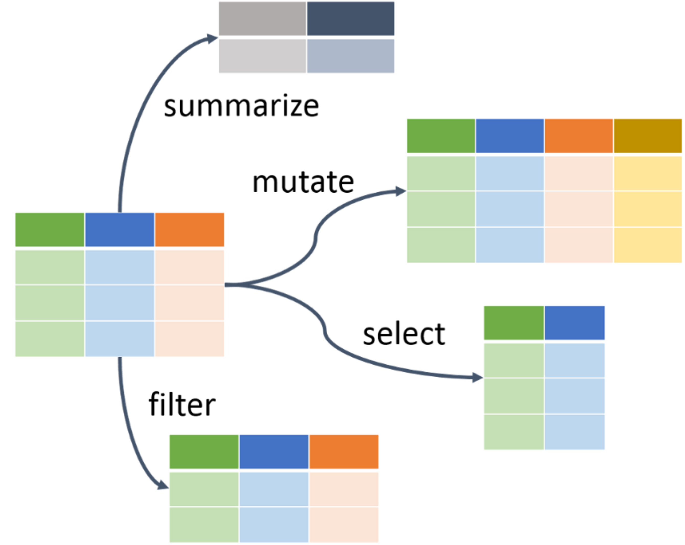</center>

## Funções {.smaller}

Gramática simples que contém funções verbais para a manipulação de dados

<br>

-   Verbos: `mutate()`, `select()`, `filter()`, `arrange()`, `summarise()`, `slice()`, `rename()`, etc.
-   Replicação: `across()`, `if_any()`, `if_all()`, `where()`, `starts_with()`, `ends_with()`, `contains()`, etc.
-   Agrupamento: `group_by()` e `ungroup()`
-   Junções: `inner_join()`, `full_join()`, `left_join()`, `right_join()`, etc.
-   Combinações: `bind_rows()` e `bind_cols()`
-   Resumos, contagem e seleção: `n()`, `n_distinct()`, `first()`, `last()`, `nth()`, etc.

## Funções {.smaller}

**Colunas**

`relocate()`: muda a ordem das colunas\
`rename()`: muda o nome das colunas\
`select()`: seleciona colunas pelo nome ou posição\
`pull()`: seleciona uma coluna como vetor\
`mutate()`: adiciona novas colunas ou resultados em colunas existentes

**Linhas**

`arrange()`: reordena as linhas com base nos valores de colunas\
`filter()`: seleciona linhas com base em valores de colunas\
`slice()`: seleciona linhas de diferente formas\
`distinct()`: remove linhas com valores repetidos com base nos valores de colunas

**Agrupamento**

`count()`: conta observações para uma ou mais coluna\
`group_by()`: agrupa linhas pelos valores das colunas\
`summarise()`: resume os dados através de funções considerando valores das colunas

## Sintaxe

-   O `tibble` é sempre o primeiro argumento das funções verbais

-   Todas seguem a mesma sintaxe:

1.  tibble
2.  operador pipe
3.  nome da função verbal com os argumentos entre parênteses

As funções verbais não modificam o tibble original

```{r eval=FALSE}
# sintaxe
tb_dplyr <- tb %>% 
  funcao_verbal1(argumento1, argumento2, ...) %>% 
  funcao_verbal2(argumento1, argumento2, ...) %>% 
  funcao_verbal3(argumento1, argumento2, ...)
```

## relocate

Reordena colunas por nome ou posição

```{r}
# reordenar colunas - nome
penguins_relocate_col <- penguins %>% 
  dplyr::relocate(sex, year, .after = island)
head(penguins_relocate_col)
```

## relocate

Reordena colunas por nome ou posição

```{r}
# reordenar colunas - posicao
penguins_relocate_ncol <- penguins %>% 
  dplyr::relocate(sex, year, .after = 2)
head(penguins_relocate_ncol)
```

## rename

Renomeia colunas

```{r}
# renomear colunas
penguins_rename <- penguins %>% 
  dplyr::rename(bill_length = bill_length_mm,
                bill_depth = bill_depth_mm,
                flipper_length = flipper_length_mm,
                body_mass = body_mass_g)
head(penguins_rename)
```

## select

Seleciona colunas pela posição ou nome

```{r}
# selecionar colunas por posicao
penguins_select_position <- penguins %>% 
  dplyr::select(3:6)
head(penguins_select_position)
```

## select

Seleciona colunas pela posição ou nome

```{r}
# selecionar colunas por nomes
penguins_select_names <- penguins %>% 
  dplyr::select(bill_length_mm:body_mass_g)
head(penguins_select_names)
```

## select

Remove colunas pela posição ou nome

```{r}
# remover colunas pelo nome
penguins_select_names_remove <- penguins %>% 
  dplyr::select(-(bill_length_mm:body_mass_g))
head(penguins_select_names_remove)
```

## select

Seleciona ou remove colunas por um padrão nos nomes

```{r}
# selecionar colunas por padrao - starts_with(), ends_with() e contains()
penguins_select_contains <- penguins %>% 
  dplyr::select(contains("_mm"))
head(penguins_select_contains)
```

## pull

Seleciona uma coluna como vetor

```{r}
# coluna para vetor
penguins_select_pull <- penguins %>% 
  dplyr::pull(bill_length_mm)
head(penguins_select_pull, 15)
```

## mutate

Adiciona colunas novas ou advindas de operações

```{r}
# adicionar colunas
penguins_mutate <- penguins %>% 
  dplyr::mutate(body_mass_kg = body_mass_g/1e3, .before = sex)
head(penguins_mutate)
```

## arrange

Reordena linhas de forma crescente pelos valores de uma coluna

```{r}
# reordenar os valores por ordem crescente
penguins_arrange <- penguins %>% 
  dplyr::arrange(body_mass_g)
head(penguins_arrange)
```

## arrange

Reordena linhas de forma decrescente pelos valores de uma coluna

```{r}
# reordenar os valores por ordem decrescente
penguins_arrange_desc <- penguins %>% 
  dplyr::arrange(desc(body_mass_g))
head(penguins_arrange_desc)
```

## arrange

Reordena linhas de forma decrescente pelos valores de uma coluna

```{r}
# reordenar os valores por ordem decrescente
penguins_arrange_desc_m <- penguins %>% 
  dplyr::arrange(-body_mass_g)
head(penguins_arrange_desc_m)
```

## filter

Filtra linhas por valores de uma coluna

```{r}
# filtrar linhas por valores de uma coluna
penguins_filter <- penguins %>% 
  dplyr::filter(species == "Adelie")
head(penguins_filter)
```

## filter

Filtra linhas por valores de várias colunas

```{r}
# filtrar linhas por valores de duas colunas
penguins_filter_two <- penguins %>% 
  dplyr::filter(species == "Adelie" & sex == "female")
head(penguins_filter_two)
```

## filter

Filtra linhas por vários valores de várias colunas

```{r}
# filtrar linhas por mais de um valor e mais de uma coluna
penguins_filter_in <- penguins %>% 
  dplyr::filter(species %in% c("Adelie", "Gentoo"),
                sex == "female")
head(penguins_filter_in)
```

## slice

Seleciona linhas por intervalos, indicando quais linhas desejamos

```{r}
# selecionar linhas por intervalos
penguins_slice <- penguins %>% 
  dplyr::slice(c(1, 3, 300:n()))
head(penguins_slice)
```

## slice

Seleciona linhas iniciais

```{r}
# selecionar linhas iniciais
penguins_slice_head <- penguins %>% 
  dplyr::slice_head(n = 5)
head(penguins_slice_head)
```

## slice

Seleciona linhas aleatoriamente, com e sem reposição

```{r}
# selecionar linhas aleatoriamente
penguins_slice_sample <- penguins %>% 
  dplyr::slice_sample(n = 30, replace = FALSE)
head(penguins_slice_sample)
```

## distinct

Retira linhas com valores duplicados com base nos valores de colunas

```{r}
# retirar linhas com valores duplicados
penguins_distinct <- penguins %>% 
  dplyr::distinct(body_mass_g)
head(penguins_distinct)
```

## distinct

Retira linhas com valores duplicados com base nos valores de colunas, mas mantendo as colunas

```{r}
# retirar linhas com valores duplicados e manter colunas
penguins_distinct_keep_all <- penguins %>% 
  dplyr::distinct(body_mass_g, .keep_all = TRUE)
head(penguins_distinct_keep_all)
```

## count

Conta valores de uma ou mais colunas (variáveis categóricas)

```{r}
# contagens de valores para uma coluna
penguins_count <- penguins %>% 
  dplyr::count(species)
penguins_count
```

## count

Conta valores de uma ou mais colunas (variáveis categóricas)

```{r}
# contagens de valores para mais de uma coluna
penguins_count_two <- penguins %>% 
  dplyr::count(species, island)
penguins_count_two
```

## count

Conta valores de uma ou mais colunas (variáveis categóricas) ordenando a contagem

```{r}
# contagens de valores para mais de uma coluna
penguins_count_two_sort <- penguins %>% 
  dplyr::count(species, island, sort = TRUE)
penguins_count_two_sort
```

## group_by

Transforma um `tibble` em um `tibble agrupado`, onde as operações são realizadas "por grupo"

```{r}
# agrupamento
penguins_group_by <- penguins %>% 
  dplyr::group_by(species)
head(penguins_group_by)
```

## summarise

Agrega ou resume dados através de funções síntese

```{r}
# resumo
penguins_summarise <- penguins %>% 
  dplyr::group_by(species) %>% 
  dplyr::summarize(body_mass_g_mean = mean(body_mass_g, na.rm = TRUE),
                   body_mass_g_sd = sd(body_mass_g, na.rm = TRUE))
penguins_summarise
```

# Exercícios

## Exercício 05 {.smaller}

Use os dados `penguins`

Adicione essas novas colunas:

-   `bill_length_mm_log10`
-   `bill_depth_mm_log10`
-   `flipper_length_mm_log10`
-   `body_mass_g_log10`

Que são a operação `log10()` das colunas:

-   `bill_length_mm_log10`
-   `bill_depth_mm_log10`
-   `flipper_length_mm_log10`
-   `body_mass_g_log10`

```{r echo=FALSE}
countdown::countdown(minutes = 5, seconds = 00, color_background = "gray30")
```

## Exercício 05

**Solução**

```{r}
# exercicio 05
penguins_log <- penguins %>% 
  dplyr::mutate(bill_length_mm_log10 = log10(bill_length_mm), 
                bill_depth_mm_log10 = log10(bill_depth_mm), 
                flipper_length_mm_log10 = log10(flipper_length_mm), 
                body_mass_g_log10 = log10(body_mass_g))
penguins_log
```

## Exercício 06

Use os dados `penguins`

Ordene as linhas de forma decrescente pela coluna `body_mass_g`

```{r echo=FALSE}
countdown::countdown(minutes = 5, seconds = 00, color_background = "gray30")
```

## Exercício 06

**Solução**

```{r}
# exercicio 06
penguins_arrange <- penguins %>% 
  dplyr::arrange(-body_mass_g)
penguins_arrange
```

## Exercício 07

Usando os dados `penguins`

Filtre as linhas com valores de:

-   `bill_length_mm` maior que 50 mm
-   `bill_depth_mm` menor que 20 mm
-   `flipper_length_mm` maior que 220 mm
-   `body_mass_g` menor que 5500 g

```{r echo=FALSE}
countdown::countdown(minutes = 5, seconds = 00, color_background = "gray30")
```

## Exercício 07

**Solução**

```{r}
# exercicio 07
penguins_filter <- penguins %>% 
  dplyr::filter(bill_length_mm > 50, 
                bill_depth_mm < 20, 
                flipper_length_mm > 220, 
                body_mass_g < 5500)
penguins_filter
```

## Exercício 08

Use os dados `penguins`

Amostre aleatoriamente 70% das linhas com `body_mass_g` menor que 5000 g

```{r echo=FALSE}
countdown::countdown(minutes = 5, seconds = 00, color_background = "gray30")
```

## Exercício 08

**Solução**

```{r}
# exercicio 08
penguins_sample <- penguins %>% 
  dplyr::filter(body_mass_g < 5000) %>% 
  dplyr::slice_sample(prop = .7)
penguins_sample
```

# stringr

background-image: url(img/cheatsheet_stringr.png)

## stringr

- Pacote para a manipulação de strings ou caracteres
- Exemplos: Correspondência de padrões, retirar e acrescentar espaços em branco, mudar maiúsculas e minúsculas
- Pode ser utilizado em conjunto com o pacote `dplyr` para manejar colunas
- Para funções mais específicas, recomenda-se usar o pacote [stringi](https://stringi.gagolewski.com/)

## stringr

Comprimento

```{r}
# comprimento
stringr::str_length(string = "penguins")
```

--

## Substituir

```{r}
# substituir
stringr::str_replace(string = "penguins", pattern = "i", replacement = "y")
```

--

## Separar

```{r}
# separar
stringr::str_split(string = "p-e-n-g-u-i-n-s", pattern = "-", simplify = TRUE)
```

---

# 9. stringr

## Extrair pela posição

```{r}
# extrair pela posicao
stringr::str_sub(string = "penguins", end = 3)
```

--

## Extrair por padrão

```{r}
# extrair por padrao
stringr::str_extract(string = "penguins", pattern = "p")
```

---

# 9. stringr

## Inserir espacos em branco

```{r}
# inserir espaco em branco - esquerda
stringr::str_pad(string = "penguins", width = 10, side = "left")

# inserir espaco em branco - direita
stringr::str_pad(string = "penguins", width = 10, side = "right")

# inserir espaco em branco - ambos
stringr::str_pad(string = "penguins", width = 10, side = "both")
```

---

# 9. stringr

## Remover espaços em branco

```{r}
# remover espacos em branco - esquerda
stringr::str_trim(string = " penguins ", side = "left")

# remover espacos em branco - direta
stringr::str_trim(string = " penguins ", side = "right")

# remover espacos em branco - ambos
stringr::str_trim(string = " penguins ", side = "both")
```

---

# 9. stringr

## Alterar minúsculas e maiúsculas

```{r}
# minusculas
stringr::str_to_lower(string = "Penguins")

# maiusculas
stringr::str_to_upper(string = "penguins")

# primeiro caracter maiusculo da primeira palavra
stringr::str_to_sentence(string = "palmer penGuins")

# primeiro caracter maiusculo de cada palavra
stringr::str_to_title(string = "palmer penGuins")
```

---

# 9. stringr

## Ordenar

```{r}
# ordenar - crescente
stringr::str_sort(x = letters)

# ordenar - decrescente
stringr::str_sort(x = letters, dec = TRUE)
```

---

# 9. stringr

## Alterar valores das colunas

```{r}
# alterar valores das colunas
penguins_stringr_valores <- penguins %>% 
  dplyr::mutate(species = stringr::str_to_lower(species))
```

--

## Alterar nome das colunas

```{r}
# alterar nome das colunas
penguins_stringr_nomes <- penguins %>% 
  dplyr::rename_with(stringr::str_to_title)
```

---

class: clear
background-image: url(img/package_forcats.png)
background-size: 400px

<br><br><br><br><br><br><br><br><br><br><br><br><br><br><br><br><br><br><br>
[forcats](https://forcats.tidyverse.org/)

---

background-image: url(img/cheatsheet_forcats.png)
background-size: 600px
background-position: 50% 50%

# 10. forcats

## Factors with forcats Cheatsheet

<br><br><br><br><br><br><br><br><br><br><br><br><br><br><br>
[Factors with forcats Cheatsheet](https://github.com/rstudio/cheatsheets/raw/master/factors.pdf)

---

# 10. forcats

## Descrição

### Conjunto de ferramentas úteis para facilitar a manipulação de fatores e seus níveis

--

### Exemplos: mudar a ordem dos níveis, mudar os valores dos níveis, adicionar e remover níveis, combinar múltiplos níveis

--

### Pode ser utilizado em conjunto com o pacote `dplyr` para manejar colunas

---

# 10. forcats

## Converter dados de string para fator

```{r}
# converter dados de string para fator
forcats::as_factor(penguins_raw$Species) %>% head()
```

--

## Mudar o nome dos níveis

```{r}
# mudar o nome dos niveis
forcats::fct_recode(penguins$species, a = "Adelie", c = "Chinstrap", g = "Gentoo") %>% head()
```

---

# 10. forcats

## Inverter os níveis

```{r}
# inverter os niveis
forcats::fct_rev(penguins$species) %>% head()
```

--

## Especificar a ordem dos níveis

```{r}
# especificar a ordem dos niveis
forcats::fct_relevel(penguins$species, "Chinstrap", "Gentoo", "Adelie") %>% head()
```

---

# 10. forcats

## Níveis pela ordem em que aparecem

```{r}
# niveis pela ordem em que aparecem
forcats::fct_inorder(penguins$species) %>% head()
```

## Ordem (decrescente) de frequência

```{r}
# ordem (decrescente) de frequecia
forcats::fct_infreq(penguins$species) %>% head()
```

---

# 10. forcats

## Agregação de níveis raros em um nível

```{r}
# agregacao de niveis raros em um nivel
forcats::fct_lump(penguins$species) %>% head()
```

--

## Transformar várias colunas em fator

```{r}
# transformar varias colunas em fator
penguins_raw_multi_factor <- penguins_raw %>% 
  dplyr::mutate(across(where(is.character), forcats::as_factor))
```

---

class: clear
background-image: url(img/package_lubridate.png)
background-size: 400px

<br><br><br><br><br><br><br><br><br><br><br><br><br><br><br><br><br><br><br>
[lubridate](https://lubridate.tidyverse.org/)

---

background-image: url(img/cheatsheet_lubridate.png)
background-size: 550px
background-position: 50% 50%

# 11. lubridate

## Dates and Times Cheatsheet

<br><br><br><br><br><br><br><br><br><br><br><br><br><br><br>
[Dates and Times Cheatsheet](https://github.com/rstudio/cheatsheets/raw/master/lubridate.pdf)

---

background-image: url(img/lubridate_allison.png)
background-size: 400px
background-position: 50% 90%

# 11. lubridate

## Pacote à parte do tidyverse

### Carregar sempre que for utilizar

```{r}
# carregar
library(lubridate)
```

<br><br><br><br><br><br><br><br><br><br>
[@allison_horst](https://twitter.com/allison_horst)

---

# 11. lubridate

## Descrição

### Conjunto de funções para a manipulação de dados de data e horário

--

### A manipulação desses dados não é intuitiva e muda dependendo do tipo de objeto de data e horário

--

### O formato desses dados deve levar em consideração Fusos horários, anos bissextos, horários de verão, etc.

--

### Exemplos: transformações de data/horário, componentes, arredondamentos, durações, períodos, intervalos, etc.

---

background-image: url(img/mhs_package.png)
background-size: 200px
background-position: 85% 90%

# 11. lubridate

## Tipos de dados

- **Data**: tempo em dias, meses e anos `<date>`
- **Horário**: tempo dentro de um dia `<time>`
- **Data-horário**: tempo em um instante (data mais tempo) `<dttm>`

### Para trabalhar exclusivamente com horários, podemos utilizar o pacote [hms](https://hms.tidyverse.org/)

### Algumas letras possuem significados temporais, sendo abreviações de diferentes períodos em inglês: 

<br>
- **y**ear (ano), **m**onth (mês) 

- **w**eak (semana), **d**ay (dia) 

- **h**our (hora), **m**inute (minuto) e **s**econd (segundo)

---

# 11. lubridate

## Data e horários atuais

```{r}
# extrair a data nesse instante
lubridate::today()

# extrair a data e tempo nesse instante
lubridate::now()
```

---

# 11. lubridate

## Existem três maneiras de criar um dado de data/horário

### 1. De um string ou caracter

### 2. De componentes individuais de data e horário

### 3. De um objeto de data/horário existente


---

# 11. lubridate

## **1. String ou caracter **

### Os dados de data/horário geralmente estão no formato de strings

### Podemos transformar os dados especificando a ordem dos seus componentes usando as letras `y` (ano), `m` (mês) e `d` (dia)

```{r}
# strings e numeros para datas
lubridate::dmy("03-03-2021")
```

---

# 11. lubridate

## **1. String ou caracter **

### Essas funções também aceitam números sem aspas, além funcionarem em outros diversos formatos

```{r eval=FALSE}
# strings e numeros para datas
lubridate::dmy("03-Mar-2021")
lubridate::dmy(03032021)
lubridate::dmy("03032021")
lubridate::dmy("03/03/2021")
lubridate::dmy("03.03.2021")
```

---

# 11. lubridate

## **1. String ou caracter **

### Especificar horários e Fusos horários

```{r eval=FALSE}
# especificar horarios e fuso horario
lubridate::dmy_h("03-03-2021 13")
lubridate::dmy_hm("03-03-2021 13:32")
lubridate::dmy_hms("03-03-2021 13:32:01")
lubridate::dmy_hms("03-03-2021 13:32:01", tz = "America/Sao_Paulo")
```

---

# 11. lubridate

## **2. Componentes individuais de data e horário**

```{r}
# dados com componentes individuais
dados <- tibble::tibble(
  ano = c(2021, 2021, 2021),
  mes = c(1, 2, 3),
  dia = c(12, 20, 31),
  hora = c(2, 14, 18), 
  minuto = c(2, 44, 55))
dados
```

---

# 11. lubridate

## **2. Componentes individuais de data e horário**

```{r}
# dados com componentes individuais
dados %>% 
  dplyr::mutate(data = lubridate::make_datetime(ano, mes, dia, hora, minuto))
```

---

# 11. lubridate

## **3. Objeto de data/horário existente**

```{r}
# data para data-horario
lubridate::as_datetime(today())

# data-horario para data
lubridate::as_date(now())
```

---

# 11. lubridate

## Funções para acessar e definir componentes individuais de datas e horários

- `year()`: acessa o ano
- `month()`: acessa o mês
- `day()`: acessa o dia
- `yday()`: acessa o dia do ano
- `mday()`: acessa o dia do mês
- `wday()`: acessa o dia da semana
- `hour()`: acessa as horas
- `minute()`: acessa os minutos
- `second()`: acessa os segundos

---

# 11. lubridate

## Funções para acessar e definir componentes individuais de datas e horários

```{r eval=FALSE}
# extrair
lubridate::year(now())
lubridate::month(now())
lubridate::month(now(), label = TRUE)
lubridate::day(now())
lubridate::wday(now())
lubridate::wday(now(), label = TRUE)
lubridate::second(now())
```

---

# 11. lubridate

## Inclusam de informações de datas e horários.

```{r}
# data
data <- dmy_hms("04-03-2021 01:04:56")

# incluir
lubridate::year(data) <- 2020
lubridate::month(data) <- 01
lubridate::hour(data) <- 13
```
--
```{r}
# incluir varios valores
update(data, year = 2020, month = 1, mday = 1, hour = 1)
```

---

# 11. lubridate

## Operações com datas

### Muitas vezes precisamos fazer operações com datas, como subtração, adição e divisão. Para tanto, é preciso entender três classes importantes que representam intervalos de tempo

### **1. Durações**: representam um número exato de segundos

### **2. Períodos**: representam unidades humanas como semanas e meses

### **3. Intervalos**: representam um ponto inicial e final

---

# 11. lubridate

## **1. Durações**

###Registram o intervalo de tempo em segundos, com alguma unidade de tempo maior entre parênteses

### Funções

- `duration()`: cria data em duração
- `as.duration()`: converte datas em duração
- `dyears()`: duração de anos
- `dmonths()`: duração de meses
- `dweeks()`: duração de semanas
- `ddays()`: duração de dias
- `dhours()`: duração de horas
- `dminutes()`: duração de minutos
- `dseconds()`: duração de segundos

---

# 11. lubridate

## **1. Durações**

### Subtração de datas e conversão para duração

```{r}
# subtracao de datas
tempo_estudando_r <- lubridate::today() - lubridate::dmy("30-11-2011")

# conversao para duracao
tempo_estudando_r_dur <- lubridate::as.duration(tempo_estudando_r)
```

---

# 11. lubridate

## **1. Durações**

### Criando durações

```{r}
# criando duracoes
lubridate::duration(90, "seconds")
lubridate::duration(1.5, "minutes")
lubridate::duration(1, "days")
```

---

# 11. lubridate

## **1. Durações**

### Transformação das durações

```{r eval=FALSE}
# transformacao da duracao
lubridate::dseconds(100)
lubridate::dminutes(100)
lubridate::dhours(100)
lubridate::ddays(100)
lubridate::dweeks(100)
lubridate::dyears(100)
```

---

# 11. lubridate

## **1. Durações**

### Operações com durações

```{r}
# somando duracoes a datas
lubridate::today() + lubridate::ddays(1)

# subtraindo duracoes de datas
lubridate::today() - lubridate::dyears(1)

# multiplicando duracoes
2 * dyears(2)
```

---

# 11. lubridate

## **2. Períodos**

### São extensões de tempo não fixados em segundos como as durações, mas flexíveis, como dias, semanas, meses ou anos

### Funções

- `period()`: cria data em período
- `as.period()`: converte datas em período
- `seconds()`: período em segundos
- `minutes()`: período em minutos
- `hours()`: período em horas
- `days()`: período em dias
- `weeks()`: período em semanas
- `months()`: período em meses
- `years()`: período em anos

---

# 11. lubridate

## **2. Períodos**

### Criando períodos

```{r}
# criando periodos
period(c(90, 5), c("second", "minute"))
period(c(3, 1, 2, 13, 1), c("second", "minute", "hour", "day", "week"))
```

---

# 11. lubridate

## **2. Períodos**

### Transformações de períodos

```{r eval=FALSE}
# transformacao de periodos
lubridate::seconds(100)
lubridate::minutes(100)
lubridate::hours(100)
lubridate::days(100)
lubridate::weeks(100)
lubridate::years(100)
```

---

# 11. lubridate

## **2. Períodos**

### Operações com os períodos

```{r}
# somando datas
lubridate::today() + lubridate::weeks(10)

# subtraindo datas
lubridate::today() - lubridate::weeks(10)

# criando datas recorrentes
lubridate::today() + lubridate::weeks(0:10)
```

---

# 11. lubridate

## **3. Intervalos**

### Períodos de tempo limitados por duas datas, possuindo uma duração com um ponto de partida, que o faz preciso para determinar uma duração

### Funções

- `interval()`: cria data em intervalo
- `%--%: cria data em intervalo
- `as.interval()`: converte datas em intervalo
- `int_start()`: acessa ou atribui data inicial de um intervalo
- `int_end()`: acessa ou atribui data final de um intervalo
- `int_length()`: comprimento de um intervalo em segundos
- `int_flip()`: inverte a ordem da data de início e da data de término em um intervalo
- `int_shift()`: desloca as datas de início e término de um intervalo
- `int_aligns()`: testa se dois intervalos compartilham um ponto final
- `int_standardize()`: garante que todos os intervalos sejam positivos
- `int_diff()`: retorna os intervalos que ocorrem entre os elementos de data/horário
- `int_overlaps()`: testa se dois intervalos se sobrepõem
- `%within%: testa se o primeiro intervalo está contido no segundo

---

# 11. lubridate

## **3. Intervalos**

### Criando intervalos

```{r}
# criando duas datas - inicio de estudos do R e nascimento do meu filho
r_inicio <- lubridate::dmy("30-11-2011")
filho_nascimento <- lubridate::dmy("26-09-2013")
r_hoje <- lubridate::today()

# criando intervalos - interval
r_intervalo <- lubridate::interval(r_inicio, r_hoje)

# criando intervalos - interval %--%
filho_intervalo <- filho_nascimento %--% lubridate::today()
```

---

# 11. lubridate

## **3. Intervalos**

### Operaçõpes com intervalos

```{r eval=FALSE}
# operacooes com intervalos
lubridate::int_start(r_intervalo)
lubridate::int_end(r_intervalo)
lubridate::int_length(r_intervalo)
lubridate::int_flip(r_intervalo)
lubridate::int_shift(r_intervalo, duration(days = 30))
```

---

# 11. lubridate

## **3. Intervalos**

### Sobreposição entre dois intervalos

```{r}
# verificar sobreposicao - int_overlaps
lubridate::int_overlaps(r_intervalo, filho_intervalo)

# verificar se intervalo esta contido
r_intervalo %within% filho_intervalo
filho_intervalo %within% r_intervalo
```

---

# 11. lubridate

## **3. Intervalos**

### Calcular quantos períodos existem dentro de um intervalo

```{r}
# periodos dentro de um intervalo - anos
r_intervalo / lubridate::years()
r_intervalo %/% lubridate::years()

# periodos dentro de um intervalo - dias e semandas
filho_intervalo / lubridate::days()
filho_intervalo / lubridate::weeks()
```

---

# 11. lubridate

## **3. Intervalos**

### Transformações dos dados para períodos

```{r}
# tempo total estudando R
lubridate::as.period(r_intervalo)

# idade do meu filho
lubridate::as.period(filho_intervalo)
```

---

background-image: url(img/lubridate_fusos01.png), url(img/lubridate_fusos02.png)
background-size: 600px, 500px
background-position: 5% 75%, 90% 75%

# 11. lubridate

## Fusos horários

### Tendem a ser um **fator complicador** quando precisamos analisar informações **instantâneas de tempo (horário)** de outras partes do planeta, ou mesmo fazer conversões dos horários

<br><br><br><br><br><br><br><br><br><br>
[Fuso horário, como funciona](https://ipemsp.wordpress.com/2020/09/30/fuso-horario-como-funciona/), [Paradigma dos fusos horários e suas ocasionalidades](https://medium.com/@plowzzer/paradigma-dos-fusos-hor%C3%A1rios-997a3eb29039)

---

# 11. lubridate

## Fusos horários

### Descobrir o fuso horário que o R está considerando

```{r}
# fuso horario no r
Sys.timezone()
```

### Listagem dos nomes dos fusos horários

```{r}
# verificar os fusos horarios
length(OlsonNames())
head(OlsonNames())
```

---

# 11. lubridate

## Fusos horários

### Perguntar que horas são em outra parte do globo ou fazer as conversões

```{r}
# que horas sao em...
lubridate::with_tz(lubridate::now(), tzone = "America/Sao_Paulo")
lubridate::with_tz(lubridate::now(), tzone = "GMT")
lubridate::with_tz(lubridate::now(), tzone = "Europe/Berlin")

# alterar o fuso sem mudar a hora
lubridate::force_tz(lubridate::now(), tzone = "GMT")
```

---

class: clear
background-image: url(img/package_purrr.png)
background-size: 400px

<br><br><br><br><br><br><br><br><br><br><br><br><br><br><br><br><br><br><br>
[purrr](https://purrr.tidyverse.org/)

---

background-image: url(img/cheatsheet_purrr.png)
background-size: 600px
background-position: 50% 50%

# 12. purrr

## Apply functions with purrr Cheatsheet

<br><br><br><br><br><br><br><br><br><br><br><br><br><br><br>
[Apply functions with purrr Cheatsheet](https://github.com/rstudio/cheatsheets/raw/master/purrr.pdf)

---

background-image: url(img/purrr_cats.jpeg)
background-size: 400px
background-position: 50% 85%

# 12. purrr

## Descrição

### Implementa a **Programação Funcional no R**, fornecendo um conjunto completo e consistente de ferramentas para trabalhar com funções e vetores

--

### Permite substituir muitos *loops* for por um código mais sucinto e fácil de ler

---

# 12. purrr

## *Loop*

## Um loop for pode ser entendido como uma iteração: um bloco de códigos é repetido mudando um contador de uma lista de possibilidades

```{r}
# loop for
for(i in 1:10){
  print(i)
}
```

---

# 12. purrr

## Programação funcional

```{r}
# loop for com map
purrr::map(.x = 1:10, .f = print)
```

---

background-image: url(img/purrr_map.png)
background-size: 600px
background-position: 85% 80%

# 12. purrr

## Estrutura

### `map(.x, .f)`
### `.x`: uma vetor, lista ou data frame
### `.f`: uma função

---

# 12. purrr

### Exemplo: aplicar a função `sum()` para somar os valores de vários elementos de uma lista

```{r}
# lista
x <- list(1:5, c(4, 5, 7), c(1, 1, 1), c(2, 2, 2, 2, 2))

# funcao map
purrr::map(x, sum)
```

---

# 12. purrr

## Tipos de retorno

### Diferentes funções retornam diferentes estruturas de dados

- `map()`: retorna uma lista
- `map_chr()`: retorna um vetor de strings
- `map_dbl()`: retorna um vetor numérico (double)
- `map_int()`: retorna um vetor numérico (integer)
- `map_lgl()`: retorna um vetor lógico
- `map_dfr()`: retorna um data frame (por linhas)
- `map_dfc()`: retorna um data frame (por colunas)

---

# 12. purrr

## Tipos de retorno

```{r}
# variacoes da funcao map
purrr::map_dbl(x, sum)
purrr::map_chr(x, paste, collapse = " ")
```

---

# 12. purrr

## Duas ou mais listas em paralelo

```{r}
# listas
x <- list(3, 5, 0, 1)
y <- list(3, 5, 0, 1)
z <- list(3, 5, 0, 1)

# map2* duas litas
purrr::map2_dbl(x, y, prod)

# pmap muitas listas
purrr::pmap_dbl(list(x, y, z), prod)
```

---

# 12. purrr

## Implementar rotinas de manipulação e análise de dados

```{r}
# resumo dos dados
penguins %>% 
  dplyr::select(where(is.numeric)) %>% 
  tidyr::drop_na() %>% 
  purrr::map_dbl(mean)
```

---

# 12. purrr

## Implementar rotinas de manipulação e análise de dados

```{r}
# analise dos dados
penguins %>%
  dplyr::group_split(island, species) %>% 
  purrr::map(~ lm(bill_depth_mm ~ bill_length_mm, data = .x)) %>% 
  purrr::map(summary) %>% 
  purrr::map("r.squared")
```

---

background-image: url(img/general_curso_r.png), url(img/person_jenny_bryan.jpeg)
background-size: 400px, 300px
background-position: 10% 70%, 90% 80%

# 12. purrr

## Material

### [Webinar de purrr avançado](https://youtu.be/vb1lD9_AFcU) - Curso-R

### [purrr tutorial](https://jennybc.github.io/purrr-tutorial/) - Jennifer (Jenny) Bryan

---

class: clear
background-image: url(img/package_furrr.png)
background-size: 400px

<br><br><br><br><br><br><br><br><br><br><br><br><br><br><br><br><br><br><br>
[furrr](https://furrr.futureverse.org/)

---

background-image: url(img/processor01.png), url(img/processor02.png)
background-size: 500px, 400px
background-position: 15% 65%, 85% 75%

# 12. furrr

## Programação funcional paralelizada

### Faz o mapeamento em paralelo utilizando os *cores* do processador

<br><br><br><br><br><br><br><br><br><br><br><br><br>
[Quick Intro to Parallel Computing in R](https://nceas.github.io/oss-lessons/parallel-computing-in-r/parallel-computing-in-r.html)

# furrr

## Programação funcional paralelizada

Número de *cores* do seu computador

```{r eval=FALSE}
# carregar
library(parallel)

# numero de cores
parallel::detectCores()
```
