## Conteúdo

<br>

- Reprodutibilidade
- Ambiente reprodutível: `renv`
- Documentos dinâmicos: `Quarto`
- `Quarto` e GitHub
- Web applications (apps): `Shiny`

## Reprodutibilidade

Capacidade de **recriar uma análise** e **obter os mesmos resultados** com os mesmos dados e códigos

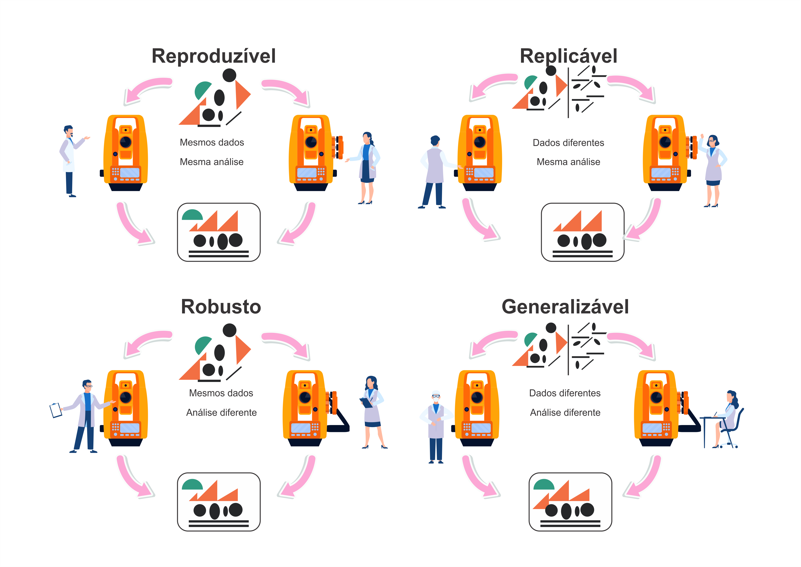{.absolute width=70% right=150 top=180}

::: footer
[Mendes-Da-Silva (2023)](https://doi.org/10.1590/S0034-759020230408)
:::


## Reprodutibilidade

**Por que reprodutibilidade importa?**

<br>

- **Transparência científica**: todos podem verificar e entender o processo  
- **Reutilização de código e dados**: economiza tempo e reduz erros  
- **Colaboração eficiente**: equipes trabalham com o mesmo ambiente  
- **Base sólida**: análises confiáveis, auditáveis e atualizáveis  

## Reprodutibilidade

**Pilares**

::: {style="font-size: 70%;"}

1. **Organização do projeto**  
   - Diretórios: `/data`, `/R`, `/output`, `/scripts`  
   
2. **Gerenciamento de dependências**  
   - `renv`: fixar versões dos pacotes  

3. **Controle de versão**  
   - git + GitHub para rastrear mudanças  

4. **Documentação clara**  
   - Descrever métodos e passos no `README` ou documento `Quarto`  

5. **Automação e repetição**  
   - Scripts reproduzem todo o fluxo das análises
   - Web applications (apps) `Shiny` para interação on-line
:::

# Pacotes no R

## Pacotes no R

- Os pacotes **mudam com o tempo** (versões)
- **Quebras de código** entre as principais versões
- Acessível a partir de **diferentes repositórios** (CRAN, GitHub, R Universe, etc.)
- Apenas **uma versão** de um pacote pode ser **instalada**
- Um pacote pode ter **muitas dependências**

. . .

>  Temos que especificar os **pacotes** necessários, suas **versões** e os **repositórios** nos quais eles estão acessíveis

## Pacotes no R

**Biblioteca vs pacote**

- *Biblioteca*: diretório onde os pacotes são instalados
- *Pacote*: coleção de funções, documentação, dados e testes

```{r}
# bibliotecas
.libPaths()
```

```{r}
# pacotes
find.package("base")
find.package("renv")
```

# 

<center>

</center>

::: footer
[renv](https://rstudio.github.io/renv/index.html)
:::

## renv

**Gerenciamento de pacotes**

- Cria um **ambiente reprodutível** (***r**eproducible **env**ironment*) e **isolado** de pacotes para cada projeto  
- Armazena versões dos pacotes em `renv.lock`  

```{r eval=FALSE}
install.packages("renv")
library(renv)
```

<center>

</center>

::: footer
[renv](https://rstudio.github.io/renv/index.html)
:::

## renv

**Por que usar `renv`?**

- Evita **conflitos de versão** funções mudam entre versões
- Reproduz resultados mesmo após **atualizações do R**
- **Compartilha** ambientes com colegas ou colaboradores  
- **Documenta** automaticamente os pacotes usados  

<center>

</center>

::: footer
[renv](https://rstudio.github.io/renv/index.html)
:::

## renv

**Funções**

<br>

::: {style="font-size: 70%;"}
| Função           | Descrição                                                         |
|:-----------------|:------------------------------------------------------------------|
| `init()`         | Inicializa `renv` em um projeto                                   |
| `status()`       | Verifica consistências entre o lockfile e a biblioteca do projeto |
| `snapshot()`     | Registra o estado atual da biblioteca do projeto no lockfile      |
| `restore()`      | Restaura a biblioteca do projeto a partir de um lockfile          |
| `install()`      | Instala pacotes na biblioteca do projeto                          |
| `remove()`       | Remove pacotes da biblioteca do projeto                           |
| `deactivate()`   | Desativa temporariamente `renv` para o projeto                    |
| `activate()`     | (Re)ativa `renv` no projeto                                       |
:::

## renv

**Workflow**

<center>

</center>

::: footer
[renv](https://rstudio.github.io/renv/index.html)
:::

## renv

**Sistema de bibliotecas**

<br>

:::: {.columns}
::: {.column width=50%}

:::
::: {.column width=50%}

:::
::::

::: footer
[Reproducible Research in Computational Ecology](https://rdatatoolbox.github.io/)
:::

## renv

**Arquivos e diretório**

::: {style="font-size: 70%;"}
- `.Rprofile`: arquivo de perfil do projeto do RStudio
- `renv/`: diretório que armazena as versões dos pacotes
- `renv.lock`: arquivo com as **versões** de cada pacote para **reconstruir o ambiente**
:::

```
.
├── .Rprofile          # Activate renv on project opening
│
├── renv/
│   ├── .gitignore     # Ignore large renv files (e.g. packages)
│   ├── activate.R     # R script to launch renv
│   ├── library/       # R packages
│   └── settings.dcf   # renv settings
│
└── renv.lock
```

## renv

**Fluxo de uso**

:::: {.columns}
::: {.column width=60%}
```{r eval=FALSE}
# Inicializar ambiente renv
renv::init()

# Verificar o estado atual dos pacotes
renv::status()

# Instalar pacotes usando o renv
renv::install("tidyverse")

# Registrar estado atual dos pacotes
renv::snapshot()

# Restaurar ambiente em outra máquina
renv::restore()
```
:::
::: {.column width=40%}
<center>
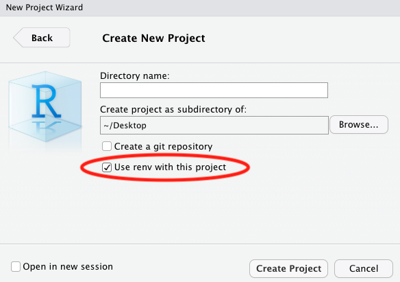
</center>
:::
::::

::: footer
[Reproducible Research in Computational Ecology](https://rdatatoolbox.github.io/)
:::

## renv

**Colaborando com `renv`**

- Basta compartilhar o arquivo `renv.lock`
- Então seu colega terá que inicializar o `renv` no projeto
- Todos os pacotes no arquivo `renv.lock` serão instalados na biblioteca do projeto

```{r eval=FALSE}
# Restaurar ambiente em outra máquina
renv::restore()
```

## renv

**Recomendações**

- Use `renv` no **final do projeto** para congelar seu ambiente de pacotes e depois compartilhar o `renv.lock`
- Adicione `renv/` ao `.gitignore`
- Versionar somento o `renv.lock`

# Documentação no R

## Documentação no R

<center>

</center>

::: footer
Artwork by [@allison_horst](https://x.com/allison_horst)
:::

## Documentação no R

**Documentação de pesquisa**

::: {style="font-size: 65%;"}
- Registro sistemático, claro e organizado das **etapas** de um projeto científico, desde o planejamento até a publicação

- Garante que o trabalho possa ser **entendido, verificado e reproduzido** por outros pesquisadores
:::

<center>

</center>

::: footer
[Research documentation](https://www.colabra.ai/course/research-documentation/)
:::

## Documentação no R

**Escrita científica**

<center>
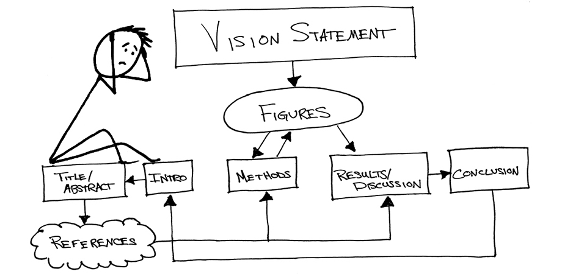
</center>

::: footer
[10 Simple Steps to Writing a Scientific Paper](https://spie.org/news/photonics-focus/janfeb-2020/how-to-write-a-scientific-paper)
:::

## Documentação no R

**Programação Literária**

::: {style="font-size: 60%;"}
> Programação literária é um **paradigma de programação** introduzido em 1984 por **Donald Knuth** (LaTeX), no qual um programa de computador é apresentado como uma explicação de como ele funciona em uma **linguagem natural** (e.g. inglês), **intercalado** (embutido) com **trechos** de macros e código-fonte tradicional, a partir dos quais um código-fonte compilável pode ser gerado.
:::

::::: columns
::: {.column .center width="50%"}
::: {style="font-size: 70%;"}
**Conceito inicial**
:::
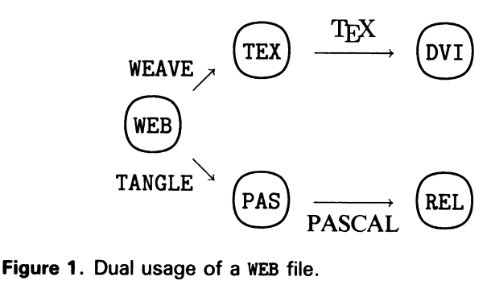{width="80%"}
:::
::: {.column .center width="50%"}
::: {style="font-size: 70%;"}
**Implementação moderna com `Quarto`**
:::
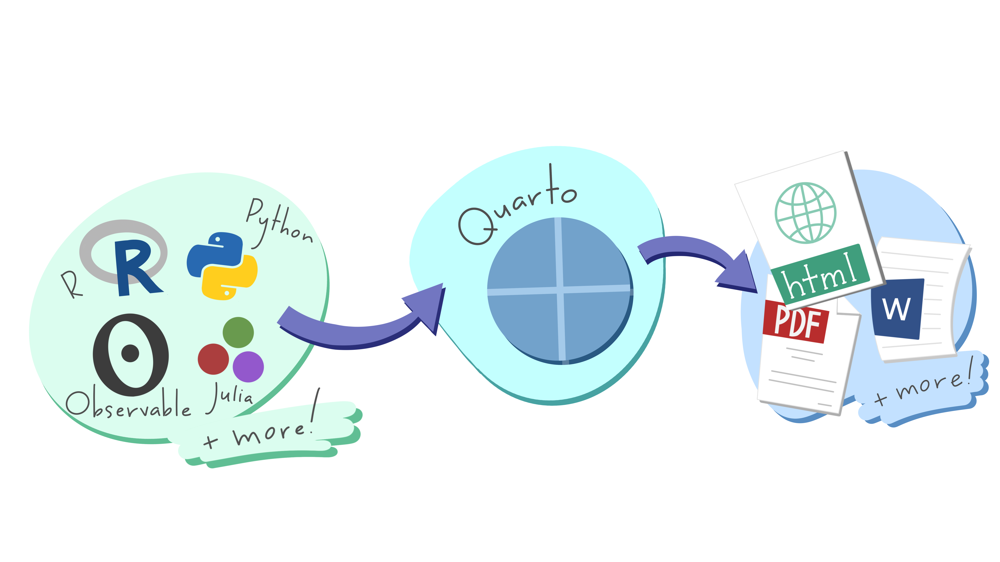
:::
:::::

::: footer
[Reproducible Research in Computational Ecology](https://rdatatoolbox.github.io/)
:::

# 

<center>

</center>

::: footer
[Quarto](https://quarto-dev.github.io/quarto-r)
:::


## Quarto

**Descrição**

::: {style="font-size: 80%;"}
- Fornece uma estrutura para ciência de dados, combinando **código, resultados e texto**
- Documentos são totalmente **reproduzíveis**, automatizando a inclusão das últimas versões dos resultados e análises 
- `Quarto` é a nova geração do R Markdown
:::

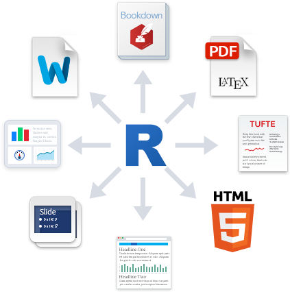{.absolute width="400" height="400" right="0" top="300"} 
{.absolute width="550" height="130" right="500" top="480"}

::: footer
[R Markdown](https://rmarkdown.rstudio.com/), [shiny](https://shiny.rstudio.com/), [quarto](https://quarto.org/)
:::


## Quarto

**Software**

::: {style="font-size: 70%;"}
- Software novo que não depende do R (instalado com o RStudio)
- Interface de linha de comando - *Command Line Interface (CLI)*
- Podemos usar o `Quarto` no terminal
:::

```{bash}
quarto help
```

## Quarto

**Multiplas saídas**

::: {style="font-size: 80%;"}
- Múltiplos formatos de **saída**: páginas web, PDFs, Word, sites, livros e mais
:::

<br>
<center>

</center>

::: footer
[Reproducible Research in Computational Ecology](https://rdatatoolbox.github.io/)
:::

## Quarto

**Usos**

::: {style="font-size: 70%;"}
1. Comunicação com tomadores de decisão ou público mais amplo, com foco nas **conclusões**, não nos códigos das análises

2. Colaboração com outros cientistas de dados, interessados tanto nas **conclusões quanto nos códigos**

3. Ambiente para fazer ciência de dados, como um **caderno de laboratório moderno**, registro do que foi feito e dos pensamentos
:::

<center>
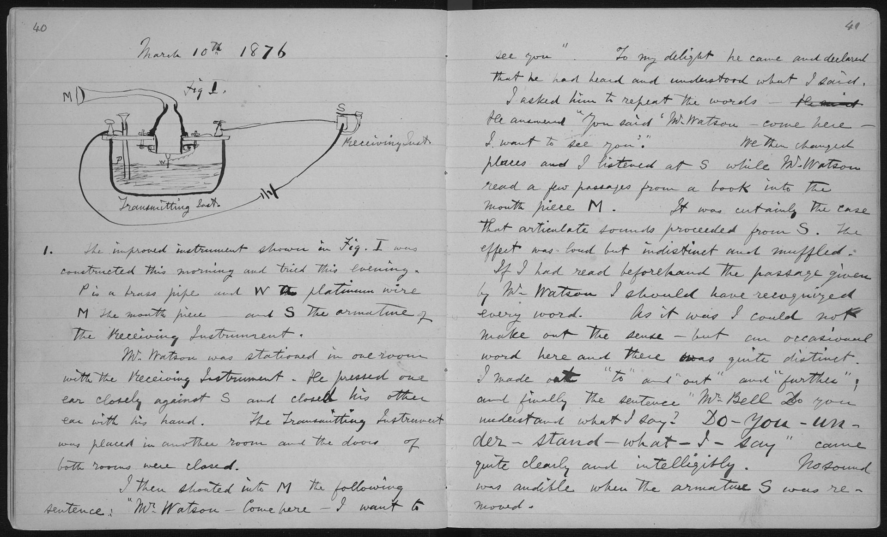
</center>

::: footer
[Caderno de laboratório](https://pt.wikipedia.org/wiki/Caderno_de_laborat%C3%B3rio)
:::

## Quarto

**Funcionamento**

<br>

<center>
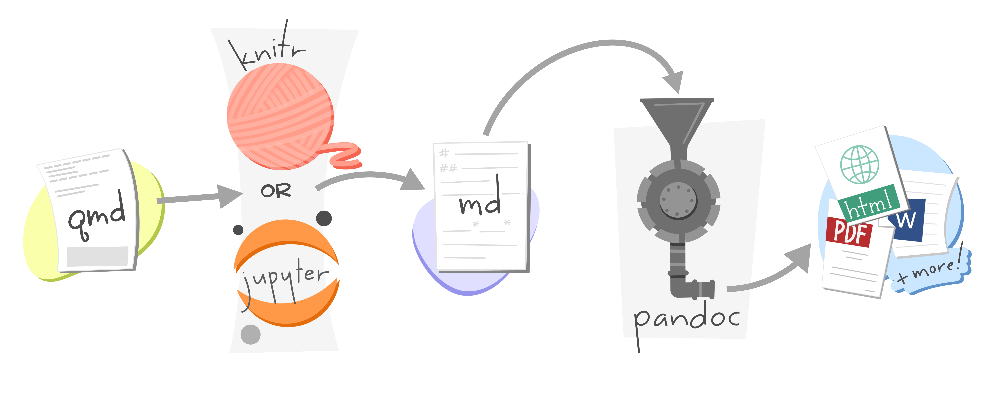
</center>

::: footer
Artwork by [@allison_horst](https://x.com/allison_horst)
:::

## Quarto

**Funcionamento**

<br>

<center>
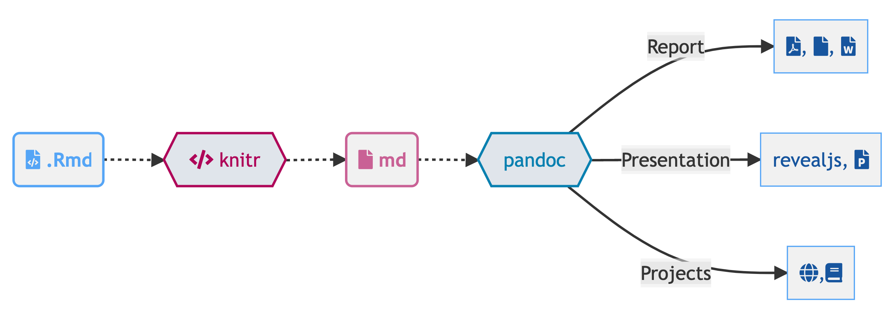
</center>

::: footer
Artwork by [@allison_horst](https://x.com/allison_horst)
:::

## Quarto

**Projeto `Quarto`**

<center>
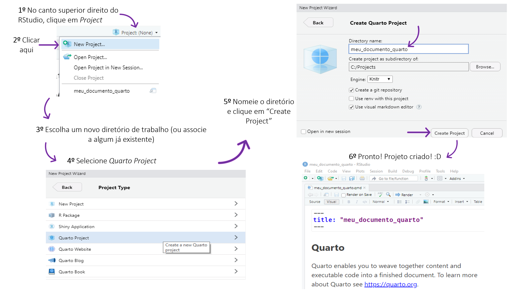
</center>

::: footer
[E aí, vamos falar de Quarto?](https://rladies-sp.org/posts/2023-02-tutorial-quarto/#o-primeiro-passo)
:::

## Quarto

**Arquivo `Quarto` (.qmd)**

<center>
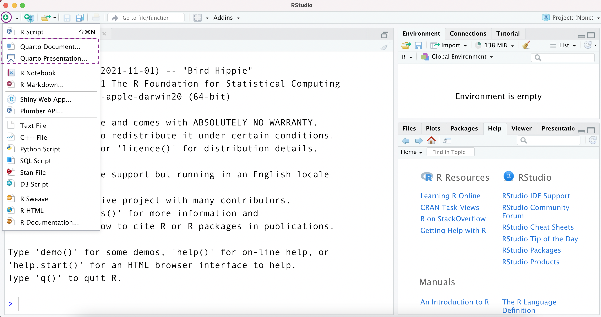
</center>

::: footer
[Conhecendo o Quarto: a nova geração do RMarkdown](https://beatrizmilz.github.io/202211-quarto-amostra-IME-USP/slide-quarto.html#/title-slide)
:::

## Quarto

**Arquivo `Quarto` (.qmd)**

<center>
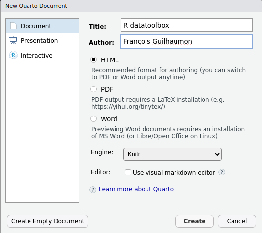
</center>

::: footer
[Reproducible Research in Computational Ecology](https://rdatatoolbox.github.io/)
:::

## Quarto

**Arquivo `Quarto` (.qmd) - Source editor**

<center>
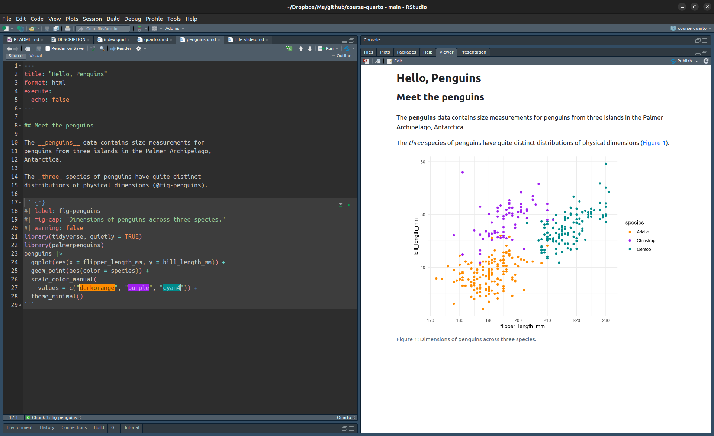
</center>

::: footer
[Reproducible Research in Computational Ecology](https://rdatatoolbox.github.io/)
:::

## Quarto

**Arquivo `Quarto` (.qmd) - Visual editor**

<center>
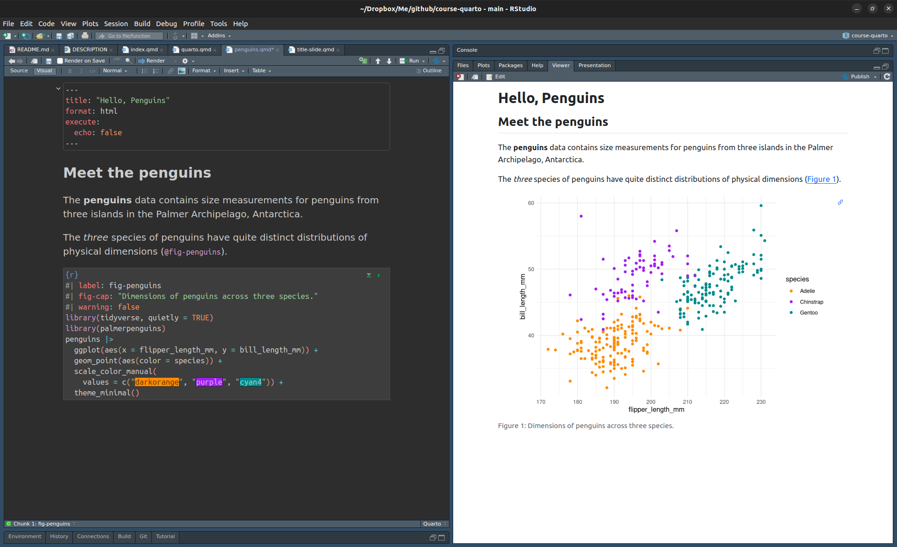
</center>

::: footer
[Reproducible Research in Computational Ecology](https://rdatatoolbox.github.io/)
:::

## Quarto

**Arquivo `Quarto` (.qmd) - Renderizar**

<center>
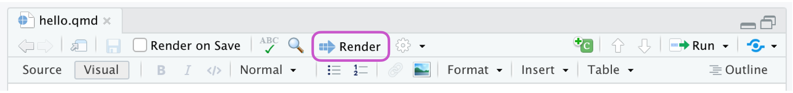
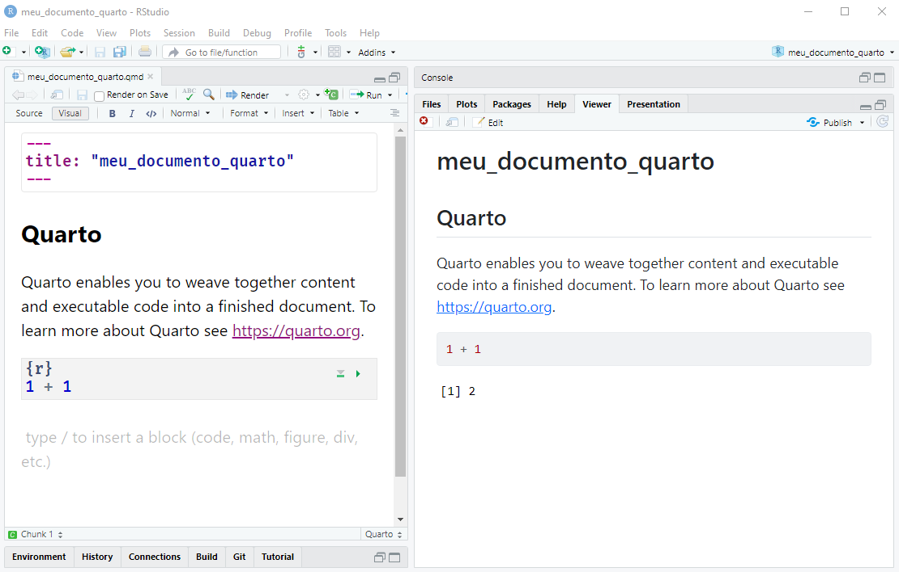
</center>

::: footer
[Reproducible Research in Computational Ecology](https://rdatatoolbox.github.io/), [E aí, vamos falar de Quarto?](https://rladies-sp.org/posts/2023-02-tutorial-quarto/#o-primeiro-passo)
:::

## Quarto

**Arquivo `Quarto` (.qmd) - Anatomia**

::: columns
::: {.column width="40%"}
<br><br><br>
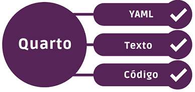
:::

::: {.column width="60%"}
::: {style="font-size: 70%;"}
<br><br>

- YAML (*Yet Another Markup Language*): cabeçalho (início do `.qmd`) onde são inseridas as configurações do documento (formatação, data, título, autor etc.), delimitado por `---` e `---`
- Texto: usa markdown como sua sintaxe de documento principal
- Códigos (*chunks*): blocos de códigos onde se insere códigos em R, Python, Julia e outros, delimitado por ` ```{r} ` e ` ``` `
:::
:::
:::

::: footer
[E aí, vamos falar de Quarto?](https://rladies-sp.org/posts/2023-02-tutorial-quarto/#o-primeiro-passo)
:::

## Quarto

**Arquivo `Quarto` (.qmd) - Anatomia**

::: columns
::: {.column width="40%"}
<br><br><br>

:::

::: {.column width="60%"}
::: {style="font-size: 60%;"}
```{bash}
#| eval: false
#| echo: true
#| code-line-numbers: "|1-6|8-15|17-29|"

---
title: "Hello, Penguins"
format: html
execute:
  echo: false
---

## Meet the penguins

The __penguins__ data contains size measurements for 
penguins from three islands in the Palmer Archipelago, 
Antarctica.

The _three_ species of penguins have quite distinct 
distributions of physical dimensions (@fig-penguins).

# ```{r}
#| label: fig-penguins
#| fig-cap: "Dimensions of penguins across three species."
#| warning: false
library(tidyverse, quietly = TRUE)
library(palmerpenguins)
penguins |>
  ggplot(aes(x = flipper_length_mm, y = bill_length_mm)) +
  geom_point(aes(color = species)) +
  scale_color_manual(
    values = c("darkorange", "purple", "cyan4")) +
  theme_minimal()
# ```
```

:::
:::
:::

::: footer
[Reproducible Research in Computational Ecology](https://rdatatoolbox.github.io/), [E aí, vamos falar de Quarto?](https://rladies-sp.org/posts/2023-02-tutorial-quarto/#o-primeiro-passo)
:::

## Quarto

**Arquivo `Quarto` (.qmd) - Anatomia**

<br>

::::: columns
::: {.column .center width="55%"}
::: {style="font-size: 55%;"}
```{bash}
#| eval: false
#| echo: true

---
title: "Hello, Penguins"
format: html
execute:
  echo: false
---

## Meet the penguins

The __penguins__ data contains size measurements for 
penguins from three islands in the Palmer Archipelago, 
Antarctica.

The _three_ species of penguins have quite distinct 
distributions of physical dimensions (@fig-penguins).

#| label: fig-penguins
#| fig-cap: "Dimensions of penguins across three species."
#| warning: false
library(tidyverse, quietly = TRUE)
library(palmerpenguins)
penguins |>
  ggplot(aes(x = flipper_length_mm, y = bill_length_mm)) +
  geom_point(aes(color = species)) +
  scale_color_manual(
    values = c("darkorange", "purple", "cyan4")) +
  theme_minimal()

```
:::
:::

::: {.column .center width="45%"}
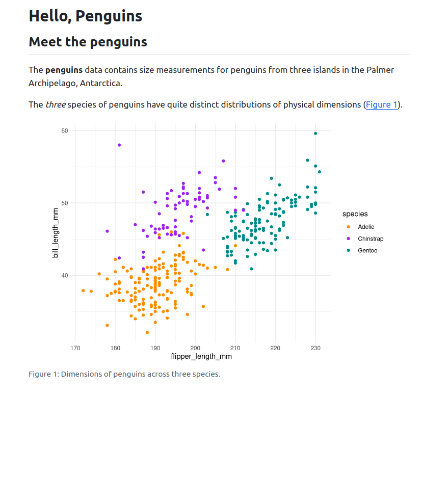
:::
:::::

::: footer
[Reproducible Research in Computational Ecology](https://rdatatoolbox.github.io/)
:::

## Quarto

**Arquivo `Quarto` (.qmd) - YAML - Formato**

::: {style="font-size: 60%;"}

HTML

```{bash eval=FALSE}
---
title: "Título"
format: html
editor: visual
---
```

Word

```{r eval=FALSE}
---
title: "Título"
format: docx
editor: visual
---
```

PDF 

> Precisa instalar um pacote LaTeX

```{r eval=FALSE}
---
title: "Título"
format: pdf
editor: visual
---
```
:::

::: footer
[Conhecendo o Quarto: a nova geração do RMarkdown](https://beatrizmilz.github.io/202211-quarto-amostra-IME-USP/slide-quarto.html#/title-slide)
:::

## Quarto

**Arquivo `Quarto` (.qmd) - Texto - markdown**

::: {style="font-size: 90%;"}
- `Markdown` é um formato de texto simples projetado para ser fácil de escrever e, ainda mais importante, fácil de ler

- `Quarto` é baseado no `Pandoc` e usa sua variação de `markdown` como sintaxe de documento
:::

<center>

</center>

::: footer
[Reproducible Research in Computational Ecology](https://rdatatoolbox.github.io/)
:::

## Quarto

**Arquivo `Quarto` (.qmd) - Texto - markdown**

::::: columns
::: column
::: {style="font-size: 70%;"}
<br>
```{bash}
#| eval: false
#| echo: true

### Text formatting
*italic* **bold** ~~strikeout~~ `code`
superscript^2^ subscript~2~
[underline]{.underline} [small caps]{.smallcaps}

### Lists
-   Bulleted list item 1
-   Item 2
    -   Item 2a
    -   Item 2b
1.  Numbered list item 1
2.  Item 2.

### Equations
inline math: $E = mc^{2}$
```
:::
:::

::: column
::: {style="font-size: 50%;"}

<br>

### Text formatting

*italic* **bold** ~~strikeout~~ `code`

superscript^2^ subscript~2~

[underline]{.underline} [small caps]{.smallcaps}

### Lists

-   Bulleted list item 1
-   Item 2
    -   Item 2a
    -   Item 2b
1.  Numbered list item 1
2.  Item 2.

### Equations
inline math: $E = mc^{2}$
:::
:::::
:::

::: footer
[Reproducible Research in Computational Ecology](https://rdatatoolbox.github.io/)
:::

## Quarto

**Arquivo `Quarto` (.qmd) - Código - chunk**

::::: columns
::: {.column width="50%"}
::: {style="font-size: 60%;"}
<br><br>

```{bash}
#| eval: false
#| echo: true

The _three_ species of penguins have quite distinct 
distributions of physical dimensions (@fig-penguins).

````{r}
#| label: fig-penguins
#| fig-cap: "Dimensions of penguins across three species."
#| warning: false
library(tidyverse, quietly = TRUE)
library(palmerpenguins)
penguins |>
  ggplot(aes(x = flipper_length_mm, y = bill_length_mm)) +
  geom_point(aes(color = species)) +
  scale_color_manual(
    values = c("darkorange", "purple", "cyan4")) +
  theme_minimal()
````
```
:::
:::

::: {.column width="50%"}

:::
:::::

::: footer
[Reproducible Research in Computational Ecology](https://rdatatoolbox.github.io/)
:::

## Quarto

**Arquivo `Quarto` (.qmd) - Código - chunk**

<center>

</center>

::: footer
[Reproducible Research in Computational Ecology](https://rdatatoolbox.github.io/)
:::

## Quarto

**Galeria**

<br>
<center>
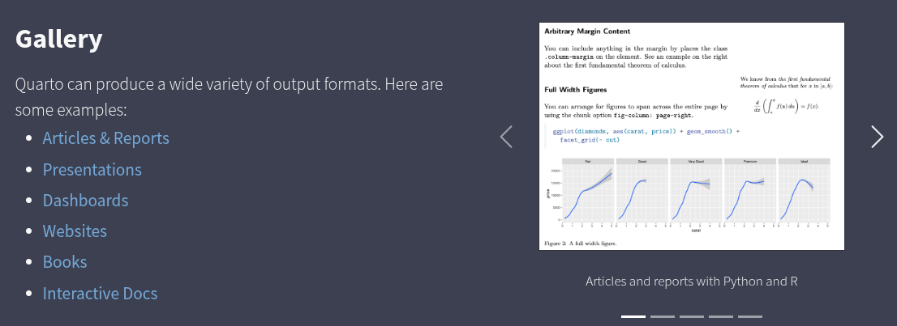
</center>

::: footer
[Quarto - Gallery](https://quarto.org/docs/gallery/)
:::

## Quarto

**`Quarto` e GitHub**

::: {style="font-size: 70%;"}
Podemos hospedar gratuitamente as saídas do `Quarto` de forma on-line no GitHub

> Repositório > Settings > Pages > GitHub Pages
:::

<center>
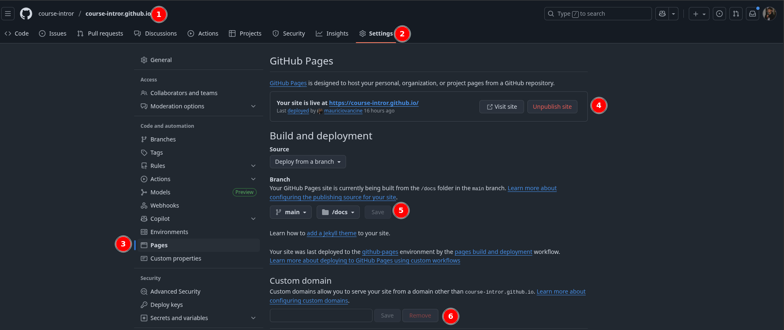
</center>

::: footer
[GitHub pages](https://github.com/course-intror/course-intror.github.io/settings/pages)
:::

## Shiny

**Descrição**

::: {style="font-size: 70%;"}
- Framework do R para criar **aplicações web interativas**
- Permite **construir** dashboards, painéis de visualização, e ferramentas analíticas
- Totalmente **integrado ao R** (sem necessidade de HTML/CSS/JS)
:::

<center>

</center>

::: footer
[Shiny](https://shiny.posit.co/)
:::

## Shiny

**Exemplo**

::: {style="font-size: 80%;"}
- Disponibilização de **redes de interação planta-dispersor** na Mata Atlântica
:::

<center>
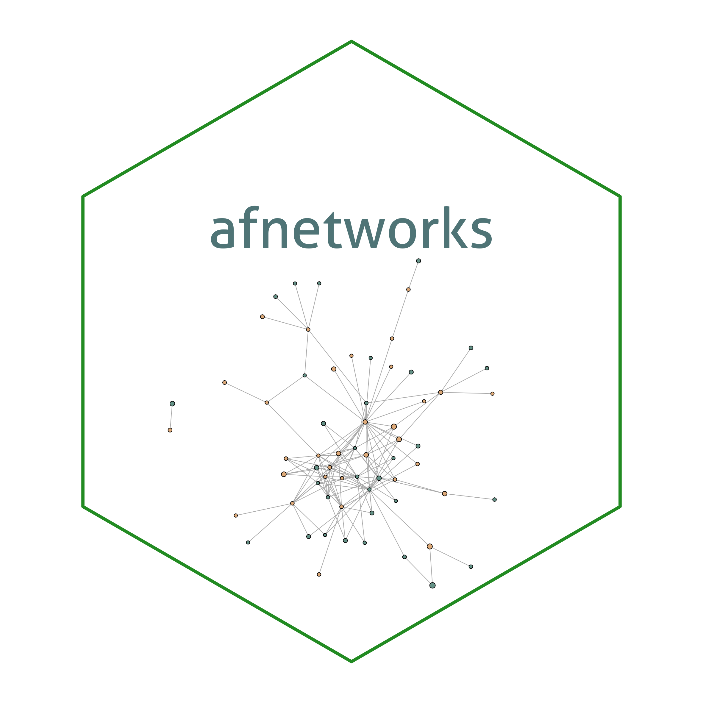
</center>

::: footer
[afnetworks](https://lddiv.shinyapps.io/shiny-atlantic-forest-networks)
:::

## Muito obrigado!

::: columns
::: {.column width="50%"}
**Agradecimentos**:

- [Beatriz Milz](https://beatrizmilz.com/)

{.absolute width=40% right=650 top=350}
:::

::: {.column width="50%"}
**Contato**:

[mauricio.vancine@gmail.com]()
[mauriciovancine.github.io](https://mauriciovancine.github.io)

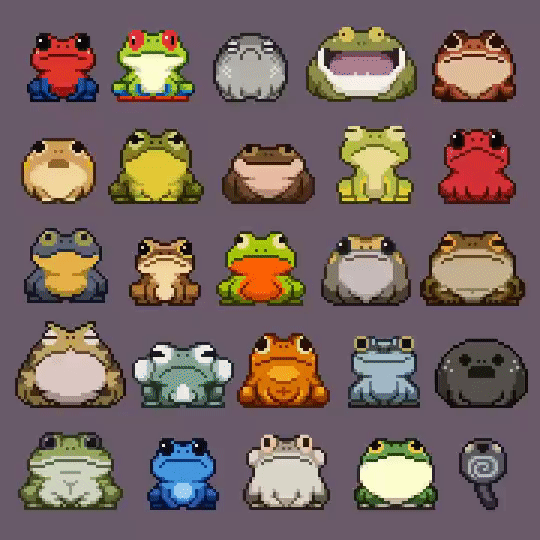{.absolute width=40% right=90 top=260}
:::
:::

:::footer
Slides por [Maurício Vancine](https://mauriciovancine.github.io), feitos com [Quarto](https://quarto.org/). Código disponível no [GitHub](https://github.com/mauriciovancine/workshop-git-github-rstudio).
:::
