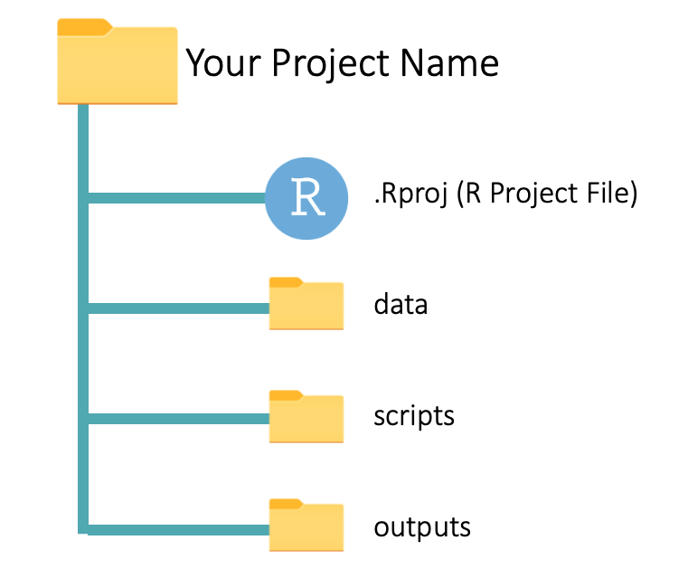
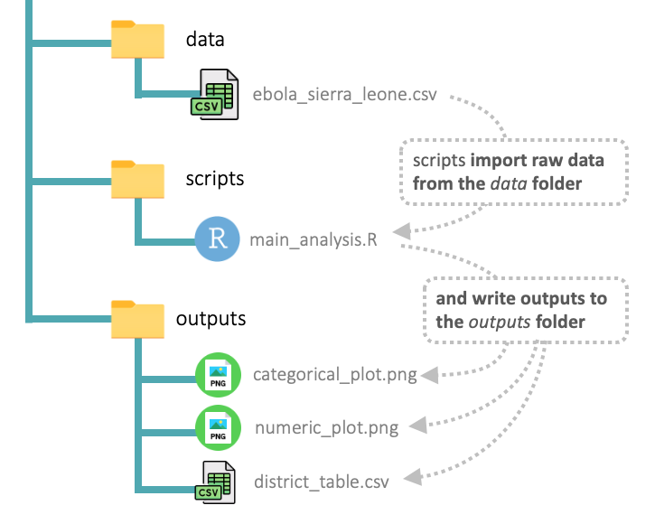

## Prática 1

- Criar um novo projeto do RStudio

{.absolute width="450" height="400" right="500" top="230"}
{.absolute width="450" height="400" right="0" top="230"}

## Prática 2

- Criar um ambiente virtual do R com o pacote `renv`

```{r eval=FALSE}
renv::init()
```

<center>

</center>

::: footer
[renv](https://rstudio.github.io/renv/index.html)
:::

## Prática 3

- Instalar alguns pacotes no `renv`

```{r eval=FALSE}
renv::install()
```

<center>

</center>

::: footer
[renv](https://rstudio.github.io/renv/index.html)
:::

## Prática 4

- Registrar este ambiente virtual

```{r eval=FALSE}
renv::snapshot()
```

<center>

</center>

::: footer
[renv](https://rstudio.github.io/renv/index.html)
:::

## Prática 5

- Restaurar ambiente em outro diretório

```{r eval=FALSE}
renv::restore()
```

<center>

</center>

::: footer
[renv](https://rstudio.github.io/renv/index.html)
:::

## Prática 6

- Criar um documento html, word e PDF usando `quarto`

::: {style="font-size: 55%;"}
HTML

```{bash eval=FALSE}
---
title: "Título"
format: html
editor: visual
---
```

Word

```{r eval=FALSE}
---
title: "Título"
format: docx
editor: visual
---
```

PDF 

> Precisa instalar um pacote LaTeX

```{r eval=FALSE}
---
title: "Título"
format: pdf
editor: visual
---
```
:::

## Prática 7

- Criar uma apresentação html usando `quarto`

<br><br>
<center>

</center>

::: footer
[Reproducible Research in Computational Ecology](https://rdatatoolbox.github.io/)
:::

## Prática 8

- Criar um website html usando `quarto`

<center>

</center>

::: footer
Artwork by [@allison_horst](https://x.com/allison_horst)
:::
